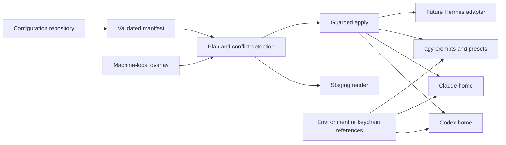

# Configurator Architecture

## Goal

Manage useful CLI-agent configuration from one version-controlled repository
without copying credentials, sessions, caches, or runtime databases.

## Source and Targets



## Current Commands

### Doctor

```bash
agentctl doctor
```

Validates:

- manifest schema version;
- resource IDs;
- source files;
- provider names;
- target roots;
- duplicate destinations;
- path traversal;
- managed file size.

### Inventory and Plan

```bash
agentctl inventory --target all
agentctl plan --target codex
```

Actions:

- `CREATE`: target does not exist;
- `UNCHANGED`: target matches source;
- `UPDATE`: target matches the last installed checksum and source changed;
- `CONFLICT`: target is unmanaged, drifted, unsafe, or a symlink.

### Render

```bash
agentctl render --target all --output ./build/rendered
```

Renders provider files into an isolated staging directory.

### Apply

```bash
agentctl apply --target codex --yes
```

Apply:

- refuses conflicts;
- requires explicit `--yes`;
- rechecks source and target checksums;
- backs up managed updates;
- writes atomically;
- stores checksums in an install-state file.

Install state:

```text
~/.config/agentctl/install-state.json
```

Backups:

```text
~/.config/agentctl/backups/<timestamp>/
```

For rename compatibility, `agentctl` reads the legacy
`~/.config/cli-agent-configurator/install-state.json` when the new state file
does not exist. The next successful apply writes the state under
`~/.config/agentctl/`; the legacy file is left untouched.

## Provider Roots

The first manifest schema allows targets only under:

| Provider | Root |
|---|---|
| Codex | `~/.codex/` |
| Claude | `~/.claude/` |
| `agy` | `~/.config/agy/` |
| Hermes | `~/.hermes/` |

The allowlist prevents a manifest from writing arbitrary home-directory paths.

## Managed Data

Good repository-managed candidates:

- commands;
- personal skills;
- policies;
- global instructions;
- model roles;
- runner routing;
- MCP definitions using secret references;
- desired plugin and skill sources;
- helper scripts;
- non-secret machine and repository profiles.

## Unmanaged Data

Never commit or overwrite:

- tokens and credentials;
- auth databases;
- session transcripts;
- runtime state databases;
- checkpoints;
- logs;
- caches;
- downloaded plugin caches;
- raw environment values;
- temporary prompt and output files.

## Structured Settings Merge

Whole-file replacement is not sufficient for every provider:

- Codex `config.toml` mixes stable preferences with project trust and marketplace
  metadata.
- Claude `settings.json` mixes stable permission and UI preferences with values
  that Claude may update.

A later manifest version will declare managed keys and use format-aware merge:

```text
parse installed file
  -> overlay declared managed keys
  -> preserve unknown and runtime-owned keys
  -> show diff
  -> backup
  -> atomic write
  -> provider doctor
```

## Profiles

Planned precedence:

```text
base
  -> machine
  -> repository
  -> local untracked override
```

Profiles may control:

- model roles;
- runner order;
- enabled MCPs;
- provider timeouts;
- optional skills and plugins;
- repository-specific profiles;
- non-secret machine paths.

Secrets remain external and are referenced by name.

## One-Way Synchronization

Initial direction:

```text
configuration repository -> provider targets
```

Changes made directly in provider homes are reported as drift. Importing them
back into the repository will be explicit and reviewable.

Automatic bidirectional synchronization is intentionally out of scope until
ownership and conflict behavior are proven.

## Next Engineering Milestones

1. Add schema files for manifest and install state.
2. Add JSON and TOML managed-key merge.
3. Add `import` into a staging directory.
4. Add `diff`, `backup`, and rollback subcommands.
5. Add profiles and local overlays.
6. Add plugin and skill lockfiles.
7. Add task state and event storage.
8. Add the provider-neutral conductor and runner router.
