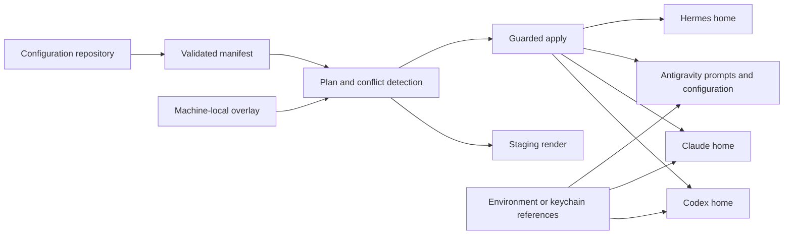

# Configurator Architecture

## Goal

Manage useful CLI-agent configuration from one version-controlled repository
without copying credentials, sessions, caches, or runtime databases.

## Source and Targets



## Current Commands

### Doctor

```bash
maisternia doctor
```

Validates:

- manifest schema version;
- resource IDs;
- source files;
- provider names;
- target roots;
- duplicate destinations;
- path traversal;
- managed file size.

### Inventory and Plan

```bash
maisternia inventory --target all
maisternia plan --target codex
```

Actions:

- `CREATE`: target does not exist;
- `UNCHANGED`: target matches source;
- `UPDATE`: target matches the last installed checksum and source changed;
- `REMOVE`: a preset no longer declares a target that it exclusively owns;
- `RELEASE`: a preset no longer declares a shared target, but another preset
  still owns it;
- `CONFLICT`: target is unmanaged, drifted, unsafe, or a symlink.

`REMOVE` and `RELEASE` are preset-scoped actions. Full-manifest planning does
not infer deletion ownership.

### Render

```bash
maisternia render --target all --output ./build/rendered
```

Renders provider files into an isolated staging directory.

### Apply

```bash
maisternia apply --target codex --yes
```

Apply:

- refuses conflicts;
- requires explicit `--yes`;
- rechecks source and target checksums;
- backs up managed updates and removals;
- writes atomically;
- stores checksums in an install-state file.

Preset apply records ownership per preset and target. On the next apply of the
same preset, targets removed from that preset are reconciled across MCP
references, commands, prompts, skills, hooks, and settings. An unchanged
exclusive target is backed up and removed. A locally changed target becomes a
conflict. A target shared by another applied preset remains installed and only
the obsolete ownership edge is released.

To remove every target owned by a preset, including after its catalog
definition has been deleted, use:

```bash
maisternia preset uninstall --scope user --target codex --yes <preset-id>
```

Deletion remains explicit and scope-specific; editing or pulling the catalog
does not mutate provider homes in the background. State written before schema
version 3 has no preset identity, so it is never guessed as removable. Applying
the current preset once records ownership for later reconciliation.

Install state:

```text
~/.config/maisternia/install-state.json
```

Backups:

```text
~/.config/maisternia/backups/<timestamp>/
```

For rename compatibility, `maisternia` reads the legacy
`~/.config/cli-agent-configurator/install-state.json` when the new state file
does not exist. The next successful apply writes the state under
`~/.config/maisternia/`; the legacy file is left untouched.

### Provider Inspection

```bash
maisternia provider list
maisternia provider inspect antigravity
maisternia provider doctor all
maisternia provider capabilities hermes
```

Provider inspection:

- resolves canonical identities and aliases;
- locates configured executables;
- reads bounded version output;
- checks provider configuration roots without reading their contents;
- rejects roots that traverse symlinks;
- reports static runner and parser safety contracts.

`provider doctor` does not execute native provider doctor commands. It reports
whether each native doctor exists and whether its checked-in contract marks it
safe for an explicit future invocation.

## Provider Roots

The first manifest schema allows targets only under:

| Provider | Root |
|---|---|
| Codex | `~/.codex/` |
| Claude | `~/.claude/` |
| Antigravity (`agy` alias) | `~/.config/agy/` |
| Hermes | `~/.hermes/` |

The allowlist prevents a manifest from writing arbitrary home-directory paths.

The Antigravity row is a compatibility target used by the current phase-prompt
manifest. It is not Antigravity's provider-owned settings root. Provider
inspection uses the current CLI roots:

| Purpose | Antigravity root |
|---|---|
| CLI settings and runtime | `~/.gemini/antigravity-cli/` |
| Global customizations, skills, and plugins | `~/.gemini/config/` |

A later renderer migration will map canonical workflow resources into provider
recognized structures under `~/.gemini/config/`. Until that mapping is
implemented and verified, the compatibility prompt tree remains managed but is
not treated as proof that Antigravity consumes those files.

## Prompt Source Boundaries

The command catalog has three layers.

### Canonical Work Phases

Files under `config/workflow/phases/` define provider-neutral behavior for
`/work-*`. They describe inputs, gates, outputs, and authority without embedding
a provider invocation.

The same source can be rendered for Codex, Claude, and Antigravity.

### Provider Adapters

Files under `config/adapters/<provider>/` implement explicit cross-provider
aliases. Claude's `/codex-*` adapters are complete executable handoffs. They
must include:

- a self-contained conversation handoff;
- the relevant model environment variable and optional Codex profile;
- temporary prompt and output files;
- an explicit `codex exec` call;
- `read-only` or `workspace-write` sandbox authority appropriate to the phase;
- phase-specific output and post-run verification.

These adapters are intentionally longer than canonical phase prompts. Reducing
an adapter to a short description removes executable behavior.

### Reusable Commands

Files under `config/commands/` contain provider-neutral commands that do not
perform a cross-provider invocation. The initial catalog uses this layer for
temporary-file cleanup.

Current managed command coverage:

| Group | Coverage |
|---|---|
| Canonical workflow | 16 `/work-*` commands for Codex, Claude, and Antigravity |
| Claude-to-Codex | 14 commands, including deep research and fleet orchestration |
| Direct Codex aliases | 12 phase and cleanup aliases |

`codex-deep-research` and `codex-fleet` remain Claude-only because their purpose
is to orchestrate independent runners. Invoking Codex from the same Codex
session would not provide an independent lane.

Repository tests verify the expected Claude-to-Codex command inventory,
required Codex execution primitives, sandbox choice, showcase rendering
integration, cleanup approval gate, and absence of personal absolute paths.

The readable-output and cleanup helper binaries are not managed yet because the
current manifest does not preserve executable file modes. Showcase keeps the
Markdown output when the readable helper is unavailable; cleanup refuses to
improvise deletion when its helper is missing.

## Managed Data

Good repository-managed candidates:

- commands;
- personal skills;
- policies;
- global instructions;
- model roles;
- runner routing;
- MCP definitions using secret references;
- desired plugin and skill sources;
- helper scripts;
- non-secret machine and repository profiles.

## Unmanaged Data

Never commit or overwrite:

- tokens and credentials;
- auth databases;
- session transcripts;
- runtime state databases;
- checkpoints;
- logs;
- caches;
- downloaded plugin caches;
- raw environment values;
- temporary prompt and output files.

## Structured Settings Merge

Whole-file replacement is not sufficient for every provider:

- Codex `config.toml` mixes stable preferences with project trust and marketplace
  metadata.
- Claude `settings.json` mixes stable permission and UI preferences with values
  that Claude may update.

A later manifest version will declare managed keys and use format-aware merge:

```text
parse installed file
  -> overlay declared managed keys
  -> preserve unknown and runtime-owned keys
  -> show diff
  -> backup
  -> atomic write
  -> provider doctor
```

## Profiles

Planned precedence:

```text
base
  -> machine
  -> repository
  -> local untracked override
```

Profiles may control:

- model roles;
- runner order;
- enabled MCPs;
- provider timeouts;
- optional skills and plugins;
- repository-specific profiles;
- non-secret machine paths.

Secrets remain external and are referenced by name.

## One-Way Synchronization

Initial direction:

```text
configuration repository -> provider targets
```

Changes made directly in provider homes are reported as drift. Importing them
back into the repository will be explicit and reviewable.

Automatic bidirectional synchronization is intentionally out of scope until
ownership and conflict behavior are proven.

## Next Engineering Milestones

1. Add schema files for the configuration manifest and install state.
2. Map canonical resources to each provider's recognized configuration layout.
3. Add JSON and TOML managed-key merge.
4. Add `import` into a staging directory.
5. Add `diff`, `backup`, and rollback subcommands.
6. Add profiles, local overlays, and plugin or skill lockfiles.
7. Resolve render requirements against provider capability contracts.
8. Add preset-library authoring, workflow DAG editing, existing provider-config inspection, and provider-native render previews.

The first task-state and manual event-ingestion increment is implemented
separately from provider configuration. See
[Event-Driven Workflow](EVENT-WORKFLOW.md).
