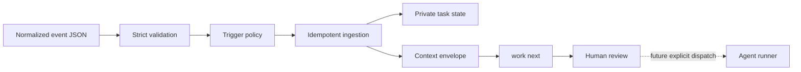

# Event-Driven Workflow

> **Experimental State Fixture:** This document describes an earlier local
> state-machine slice. It is not the `maisternia` product runtime. Do not expand
> it into live observation, phase control, approval queues, or agent dispatch;
> `maisternia` should configure external harnesses, not run them.

## Status

`maisternia` can now validate normalized events and turn them into durable,
inspectable task state. This is an experimental local state fixture, not the target maisternia product boundary.

It does not:

- run an agent;
- clone or modify a repository;
- execute text from an event;
- commit, push, comment, or open a pull request;
- expand authority to satisfy a missing capability.

## Flow



## Commands

Validate a normalized event without creating task state:

```bash
maisternia event validate ./examples/events/issue-opened.json
```

Create or update a task:

```bash
maisternia event ingest ./examples/events/issue-opened.json
```

Repeated ingestion of the same event ID and content returns the existing task.
Reusing an event ID with different content is rejected.

Inspect the registry:

```bash
maisternia task list
maisternia task show <task-id>
maisternia task context <task-id>
maisternia work next <task-id>
```

`work next` reports the prepared phase, authority, approval state, routing
strategy, and context path. Runner selection and dispatch remain unresolved and
disabled.

Use `--repo` to select the configuration repository and `--home` to isolate the
task registry:

```bash
maisternia event ingest \
  --repo /path/to/agentnyk-maisternia \
  --home /path/to/test-home \
  ./event.json
```

Flags must appear before the event path or task ID.

## Event Format

```json
{
  "schema_version": 1,
  "event_id": "github:delivery:abc123",
  "source": "github",
  "type": "issue.opened",
  "occurred_at": "2026-07-27T12:00:00Z",
  "repository": {
    "provider": "github",
    "id": "owner/repository",
    "clone_url": null
  },
  "subject": {
    "kind": "issue",
    "id": "42",
    "title": "Export fails after retry",
    "url": "https://example.invalid/issues/42"
  },
  "payload": {
    "summary": "Untrusted external text",
    "artifact_paths": []
  }
}
```

The checked-in schema is
`config/schema/trigger-event.schema.json`. Runtime validation additionally
rejects:

- unknown fields;
- unsupported trigger types;
- oversized event files and text;
- absolute, traversing, or non-normalized artifact paths;
- credential-bearing URLs;
- common embedded credential and private-key patterns.

## Policy

`config/workflow/triggers.json` maps event types to initial phases.

The initial catalog supports:

| Event | Initial phase | Authority |
|---|---|---|
| `manual` | `brief` | `read_only` |
| `issue.opened` | `scout` | `read_only` |
| `issue.assigned` | `brief` | `read_only` |
| `pull_request.opened` | `review` | `read_only` |
| `check.failed` | `analyze` | `read_only` |
| `schedule` | `brief` | `read_only` |

Policy loading fails if any trigger requests authority other than `read_only`.
The trigger authority must also match both:

- `config/workflow/capabilities.json`;
- `config/workflow/routing.json`.

Capability lists cannot overlap. A capability cannot be both required and
forbidden, or optional and forbidden.

## Durable State

The default registry is:

```text
~/.agent-workflow/
  index/events/<event-hash>.json
  locks/
  tasks/<task-id>/
    state.yaml
    context.json
    source-events.jsonl
    events.jsonl
```

`state.yaml` currently uses JSON syntax, which is a valid YAML 1.2 subset. This
keeps decoding strict and dependency-free while preserving the planned
filename.

`source-events.jsonl` stores normalized untrusted source events.

`events.jsonl` stores minimal maisternia lifecycle events. The context envelope
does not copy the source event summary, so external text is kept separate from
runner instructions.

State and context replacement is atomic. Event logs are append-only. Task
directories use mode `0700`; state, context, logs, indexes, and leases use mode
`0600`.

The event index provides idempotency across sessions. A per-event lease and
per-task writer lease prevent concurrent mutation. On Unix, leases owned by a
process that no longer exists are recovered; a live writer blocks ingestion.

## Human Boundary

Ingestion is preparation, not authorization.

An event can:

- identify a task;
- select a configured read-only starting phase;
- prepare bounded context;
- report capability requirements and routing strategy.

An event cannot:

- approve implementation;
- supply a runner capability;
- override policy;
- turn event text into instructions;
- authorize an external write.

Future dispatch must resolve a concrete runner against the capability profile.
Until that exists, context records:

```json
{
  "available": [],
  "missing": [],
  "status": "unresolved"
}
```

This avoids claiming that a runner is safe before one has been selected.

## Next Increment

The next implementation should add:

1. explicit runner capability inventories;
2. deterministic capability resolution;
3. approval records and user overrides;
4. read-only phase dispatch;
5. structured phase outcomes;
6. artifact registration with `mdmaid-desk`.

Provider webhooks, background daemons, and automatic write phases remain later
work.
