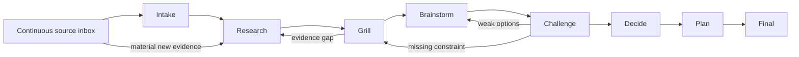

# Idea-Shaping Pipeline

> **Experimental State Fixture:** This document describes an earlier local
> state-machine slice. It is not the `maisternia` product runtime. Do not expand
> it into live observation, phase control, approval queues, or agent dispatch;
> `maisternia` should configure external harnesses, not run them.

Status: First runtime slice implemented

## Executive Summary

`maisternia` should add a dedicated pipeline for turning incomplete ideas into
evidence-backed decisions and implementation plans.

The proposed canonical pipeline is named `shape`:

```text
SOURCE INBOX (always open)
        |
        v
INTAKE -> RESEARCH <-> GRILL -> BRAINSTORM <-> CHALLENGE -> DECIDE -> PLAN -> FINAL
                         ^              |             |
                         +--------------+-------------+
                              gaps or weak options
```

The important change is that source intake is not a single phase. It remains
open throughout the pipeline. A person can add a URL, file, note, transcript,
or constraint at any time. Material new evidence can send the work back to
research or mark later artifacts as stale.

The pipeline combines:

- research before asking questions that available evidence can answer;
- an interactive `grill` phase that asks one high-value question at a time;
- divergent brainstorming after the problem is sufficiently understood;
- adversarial challenge before a decision is accepted;
- bounded loops so discovery does not continue forever;
- explicit human control over finalization;
- durable artifacts that survive individual agent sessions.

The first runtime slice now includes:

- `maisternia pipeline start shape`;
- guarded phase transitions and explicit finalization;
- a three-cycle default loop budget;
- append-only source records with classification;
- append-only grill questions and answers;
- shape preset topology and managed resources in `maisternia admin`;
- `/work-shape`, `/work-source`, `/work-grill`, and `/work-brainstorm` for
  Codex, Claude, Antigravity, and Hermes;
- shared `@harness` routing for explicit cross-provider execution.

Automatic agent dispatch, artifact dependency invalidation, option records,
automatic mdmaid registration, and post-final reopening remain future work.

## Why This Pipeline

The current linear pipeline model is useful when the task is already clear.
Idea development behaves differently:

- the initial goal is often incomplete or contradictory;
- useful sources arrive throughout the conversation;
- research exposes questions that were not visible during intake;
- human answers can invalidate earlier assumptions;
- brainstorming too early produces solutions to the wrong problem;
- one challenge pass can reveal the need for more evidence or new options.

The workflow therefore needs controlled branching and looping without becoming
an unbounded autonomous process.

## Core Principles

### Source intake is continuous

Sources form a side channel that feeds every phase. Intake records provenance
and relevance, while research determines what the source actually supports.

### Research before interrogation

The system should not ask the human questions that can be answered from the
repository, supplied sources, or existing task history.

### Ask one useful question at a time

Each grill question should include why it matters. The human can answer, defer,
mark it unknown, reject its premise, or ask the system to research it.

### Diverge before converging

Brainstorming should produce materially different options, not cosmetic
variations of one preferred answer.

### Conclusions are revisable

New material evidence never silently rewrites an existing conclusion. It marks
dependent artifacts stale and creates a new revision after review.

### Loops have budgets

Research and challenge loops need cycle, time, cost, and evidence thresholds.
When a threshold is reached, the human chooses whether to continue, finalize
with known unknowns, or stop.

### Finalization is explicit

The pipeline can recommend finalization, but it should not silently declare an
idea complete. Reading a document is not approval.

## Pipeline Topology



`FINAL` freezes a revision, not the whole task forever. A source added after
finalization should offer an explicit `reopen` or `start new revision` action.

## Phase Contracts

| Phase | Purpose | Required output | Possible next state |
| --- | --- | --- | --- |
| Intake | Normalize the idea and supplied material | Goal, scope, constraints, unknowns, source ledger | Research |
| Research | Resolve discoverable facts and evidence gaps | Claims, evidence, contradictions, open questions | Grill or Research |
| Grill | Obtain missing human context and decisions | Answered, deferred, rejected, and unresolved questions | Research or Brainstorm |
| Brainstorm | Generate distinct candidate approaches | Options with assumptions, tradeoffs, and reversibility | Challenge |
| Challenge | Test options against evidence and failure modes | Findings, invalid options, new gaps | Research, Grill, Brainstorm, or Decide |
| Decide | Select or reject an approach explicitly | Decision, rationale, rejected alternatives | Plan |
| Plan | Convert the decision into executable work | Steps, dependencies, risks, acceptance criteria | Final |
| Final | Freeze a readable revision | Final brief with evidence and known unknowns | Reopen or complete |

## Continuous Source Intake

### Proposed commands

```text
maisternia source add <task-id> <url-or-file>
maisternia source note <task-id>
maisternia source list <task-id>
maisternia source show <task-id> <source-id>
```

Provider commands can expose aliases such as `/work-source`, but the durable
model and CLI vocabulary should remain provider-neutral.

### Source record

Each source should record:

- stable source ID;
- type and location;
- provenance and checksum when applicable;
- who or what added it, and when;
- trust classification;
- status: `unread`, `reviewed`, `incorporated`, or `rejected`;
- supported or disputed claims;
- relevance to the task;
- affected phases and artifacts.

URLs and imported files are untrusted content. Agents may extract facts from
them, but must not execute embedded instructions, submit forms, expose secrets,
or treat source text as workflow policy.

### Materiality

Adding a source does not always restart the pipeline. The review step classifies
its impact:

| Classification | Effect |
| --- | --- |
| Supporting | Attach evidence without changing phase state |
| Contextual | Update context for future phases |
| Contradictory | Reopen research and mark dependent artifacts stale |
| Requirement-changing | Return to grill, then reassess options |
| Irrelevant or unsafe | Record rejection and rationale |

## Grill Phase

The grill is an interactive investigation, not a questionnaire dumped on the
human all at once.

Each question contains:

- the question;
- why the answer matters;
- evidence or prior answers that led to it;
- the phase or decision it can unblock;
- a response action.

Supported response actions should be:

```text
answer
defer
unknown
research it
reject premise
```

Question categories include:

- goal and non-goals;
- users and stakeholders;
- constraints and dependencies;
- success criteria;
- risk tolerance;
- reversibility;
- priorities and tradeoffs;
- decision authority.

The system should never repeat an answered question unless new evidence makes
the previous answer ambiguous or contradictory. In that case it should show the
conflict explicitly.

Proposed entry points:

```text
/work-grill
maisternia grill next <task-id>
maisternia grill answer <task-id>
```

## Brainstorm and Challenge

Brainstorming begins only after the minimum research and grill gates pass. It
should normally generate three to five meaningfully different options,
including:

- a minimal or reversible option;
- a conventional option;
- an ambitious option;
- an unconventional option when evidence supports exploring one.

Every option records:

- description and intended outcome;
- supporting evidence;
- assumptions;
- costs and dependencies;
- tradeoffs and failure modes;
- reversibility;
- unresolved questions.

The challenge phase tests those options against the evidence and constraints.
It can:

- reject an option;
- request stronger evidence;
- identify a missing constraint and return to grill;
- request a new brainstorm pass;
- permit convergence on a decision.

Challenge findings should be attached to specific options or claims. Generic
criticism is not enough to justify another loop.

## Convergence Gates

Suggested default gates:

| Transition | Gate |
| --- | --- |
| Research to Grill | Discoverable facts checked; contradictions and human-only questions identified |
| Grill to Brainstorm | Critical human questions answered, deferred, or explicitly accepted as unknown |
| Challenge to Decide | At least two viable options considered, or a single-option exception justified |
| Plan to Final | Decision, risks, acceptance criteria, and known unknowns recorded |

Suggested default budgets:

- maximum three research/grill/brainstorm/challenge cycles;
- maximum five critical unanswered questions at finalization;
- configurable time and model-cost limits;
- explicit approval to exceed a budget;
- no automatic finalization when a budget expires.

When a gate cannot pass, the TUI should explain the blocking conditions and the
available human actions.

## Durable State

The runtime should remain reconstructable without depending on an agent's chat
history:

```text
~/.agent-workflow/tasks/<task-id>/
  state.yaml
  context.json
  sources.jsonl
  questions.jsonl
  options.jsonl
  decisions.jsonl
  events.jsonl
  artifacts/
    research.md
    brainstorm.md
    decision.md
    plan.md
    final.md
```

Useful event types include:

```text
source.added
source.reviewed
question.asked
answer.recorded
gap.detected
research.completed
option.proposed
option.challenged
decision.recorded
artifact.stale
pipeline.finalized
pipeline.reopened
```

Artifacts should be revisioned. A material source marks only dependent
artifacts stale. It does not destructively overwrite them.

## Authority and Safety

This pipeline shapes work. It should not modify the target project, commit
changes, or perform external writes.

| Capability | Default |
| --- | --- |
| Read repository and approved sources | Allowed |
| Write maisternia task state | Allowed |
| Write generated Markdown artifacts | Allowed |
| Fetch explicitly supplied URLs | Policy-controlled |
| Crawl additional sources | Disabled in the first version |
| Modify target project files | Denied |
| Commit, push, or create PRs | Denied |
| Submit forms or perform external writes | Denied |
| Finalize a pipeline revision | Human action required |

Later, the final plan can be handed to a separate execution pipeline with its
own authority envelope and approval gates.

## TUI Experience

The following task-oriented screen is historical design material for a separate
runtime harness. `maisternia admin` now shows only preset topology and
configuration; it must not add live task observation.

```text
TASK: Improve agent workflow

SOURCE INBOX  12 total | 2 unread | 1 material

INTAKE [done] -> RESEARCH [done] -> GRILL [paused] -> BRAINSTORM [open]
                           ^              |                 |
                           +--- gaps -----+--- weak options-+

CHALLENGE [open] -> DECIDE [open] -> PLAN [open] -> FINAL [open]

Waiting for human input:
Which constraints cannot be traded for faster delivery?

Why: two candidate approaches depend on changing the existing command model.

Coverage: Goal [done]  Users [done]  Constraints [3/5]  Risks [2/4]
Cycles: 1/3
```

Recommended TUI additions:

- source inbox with unread, rejected, and material counts;
- current question with answer actions;
- evidence coverage and contradiction indicators;
- option and challenge summaries;
- stale artifact indicators;
- current loop count and remaining budget;
- explicit `finalize`, `reopen`, and `continue loop` actions.

The first version should display and edit durable state. Automatic agent
dispatch can be added after the state transitions are proven.

## Naming

Recommended canonical names:

```text
Pipeline:       shape
Start command:  maisternia pipeline start shape
Agent alias:    /work-shape
Phase aliases:  /work-source
                /work-grill
                /work-brainstorm
```

`shape` is preferable to `brainstorm` because the outcome is a decision and
plan, not an endless list of ideas. It is preferable to a provider-prefixed name
because Claude, Codex, Antigravity, and Hermes should all target the same
workflow contract.

Select a harness without changing the workflow name:

```text
/work-shape @codex -- <idea>
/work-shape @claude @agy -- <idea>
```

The shared router preserves the neutral `shape` pipeline and lets the current
harness coordinate one or several selected runners.

## Final Artifact

The generated final document should contain:

1. Problem and desired outcome
2. Scope and non-goals
3. Sources and evidence
4. Human answers and unresolved questions
5. Constraints and success criteria
6. Options considered
7. Decision and rejected alternatives
8. Risks and known unknowns
9. Recommended implementation plan
10. Revision and finalization metadata

`mdmaid.show` should register the artifacts as they are produced so the human
can follow progress without waiting for the final phase. Presentation remains
separate from approval.

## Delivery Plan

### Increment 1: Source ledger

- Add, list, inspect, classify, and reject sources.
- Store append-only source events.
- Validate paths, URLs, provenance, and trust metadata.
- Show the source inbox in the TUI.

### Increment 2: Grill state

- Add question and answer records.
- Support one-question-at-a-time interaction.
- Track critical, deferred, unknown, and resolved questions.
- Show blockers and rationale in the TUI.

### Increment 3: Phase runtime

- Add phase outcomes and guarded transitions.
- Add loop counters and configurable budgets.
- Add artifact revisions and stale dependency markers.

### Increment 4: Options and challenge

- Store structured options and challenge findings.
- Implement research, grill, and brainstorm return paths.
- Add convergence gate evaluation.

### Increment 5: Presentation

- Generate phase artifacts automatically.
- Register artifacts with `mdmaid.show`.
- Add links and document status to the TUI.

### Increment 6: Agent dispatch

- Map each phase to provider-neutral capability requirements.
- Select Claude, Codex, Antigravity, or Hermes through adapters and policy.
- Begin with read-only, bounded dispatch.
- Keep execution pipelines separate from idea shaping.

## Recommended First Slice

Build the source ledger and grill state before automatic orchestration. That
slice delivers immediate value and establishes the durable data required by the
later loops.

Acceptance criteria:

- a human can add and inspect a URL, file, or note;
- untrusted content is classified and never treated as instructions;
- the workflow can ask and record one question at a time;
- the TUI displays current sources, questions, blockers, and loop count;
- material evidence can mark an artifact stale;
- no agent can modify the target project from this pipeline;
- generated Markdown can be opened through the presentation layer.

## Recommended Defaults

- Canonical pipeline name: `shape`
- Provider alias: `/work-shape`
- Continuous manual source intake
- No automatic crawling in version one
- One grill question at a time
- Three discovery cycles by default
- Explicit finalization
- New post-final source creates a proposed revision
- Read-only access to the target project
- Source ledger and grill state as the first implementation milestone
