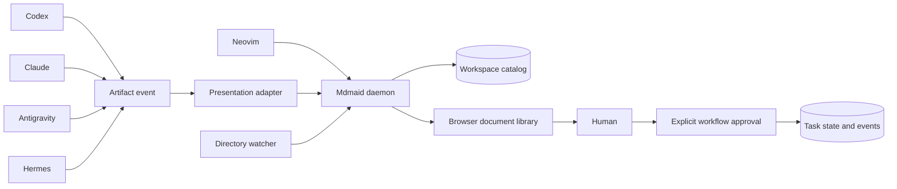

# Mdmaid Human-in-the-Loop Integration

## Status

Design proposal. No implementation is implied by this document.

## Purpose

CLI agent workflows produce plans, briefs, research, contracts, reviews, and
other Markdown artifacts. These files are useful only when the human can find,
read, compare, and approve them without reconstructing the agent session that
created them.

Mdmaid should provide the durable presentation layer for these artifacts:

- agents generate Markdown;
- the workflow records the artifact;
- mdmaid registers and renders it;
- the browser opens when human attention is required;
- approval remains a separate explicit workflow action.

The design must work across Codex, Claude, Antigravity, Hermes, editors, terminals,
and multiple concurrent sessions.

## Core Principle

Artifact generation, registration, presentation, and approval are different
operations.

```text
generate -> register -> present -> approve
```

They must never be collapsed into one implicit action.

### Generate

The workflow creates or updates a durable Markdown file.

### Register

The artifact is added to the mdmaid catalog. Registration is automatic and
does not interrupt the user.

### Present

Mdmaid opens or focuses the document when policy says human attention is
required.

### Approve

The human explicitly approves, rejects, or requests changes. Merely viewing a
document is not approval.

## Existing Foundation

Mdmaid already has most of the rendering transport:

- multi-file serving;
- per-file change watching;
- an HTTP API for adding, removing, and listing files;
- WebSocket reload notifications;
- a browser file list;
- Markdown and Mermaid rendering.

`mdmaid.nvim` adds:

- automatic registration when a Markdown buffer is opened;
- one server per Neovim session;
- dynamic port allocation;
- temporary session persistence;
- file switching and removal;
- automatic server cleanup.

The missing layer is a persistent, agent-friendly document service that exists
independently of one editor or agent process.

## Desired Experience

When `/work-brief` runs:

1. the workflow resolves the active task;
2. it writes or updates `brief.md`;
3. it records an `artifact.produced` event;
4. mdmaid registers the file;
5. the daemon opens the stable document URL;
6. the user reads the brief;
7. no approval is recorded.

When `/work-plan` runs:

1. the workflow writes `plan.md`;
2. mdmaid registers and opens it;
3. the workflow waits at the implementation approval gate;
4. the user approves or requests changes explicitly;
5. the approval is written to durable task history.

When verification produces a passing report:

1. the report is registered;
2. the browser is not interrupted;
3. the report remains available in the task document library.

When verification fails:

1. the report is registered;
2. mdmaid opens it;
3. the failure becomes the current human attention item.

## Architecture

Use one user-level mdmaid daemon with multiple workspaces.



### Why One Daemon

A user-level daemon provides:

- one discoverable document library;
- stable behavior across agent sessions;
- no port and process per ticket;
- no dependency on Neovim remaining open;
- shared access for every CLI agent;
- centralized security and path policy;
- persistent recent-document and task indexes.

The daemon may use a dynamic browser port, but it must publish connection state
to a stable local state file.

Recommended state locations:

```text
~/.local/state/mdmaid/
  daemon.json
  catalog.json
  logs/
```

`daemon.json` contains only local connection information:

```json
{
  "schema_version": 1,
  "pid": 12345,
  "host": "127.0.0.1",
  "port": 3333,
  "started_at": "2026-07-27T09:00:00Z"
}
```

The daemon owns catalog writes. Clients do not edit the catalog directly.

## Workspaces

A workspace is an allowed root containing related artifacts.

Examples:

- a repository;
- a worktree;
- `~/.agent-workflow/tasks`;
- a specific task directory.

Recommended workspace record:

```yaml
schema_version: 1
id: agentctl
name: agentctl
root: /absolute/path/to/repository
artifact_roots:
  - /absolute/path/to/repository/docs
  - /home/user/.agent-workflow/tasks
watch:
  - "**/*.md"
ignore:
  - ".git/**"
  - "node_modules/**"
  - "logs/**"
```

The daemon must only read files under registered artifact roots.

## Document Catalog

The catalog should store metadata, not document contents.

```yaml
schema_version: 1
id: project-123-plan
workspace_id: agentctl
task_id: PROJECT-123
kind: plan
title: PROJECT-123 implementation plan
path: /absolute/path/to/plan.md
status: current
attention: approval
created_at: 2026-07-27T09:10:00Z
updated_at: 2026-07-27T09:20:00Z
producer:
  provider: codex
  session_id: optional-session-id
```

Useful document kinds:

- `definition`;
- `brief`;
- `research`;
- `decision`;
- `plan`;
- `contract`;
- `handoff`;
- `progress`;
- `verification`;
- `review`;
- `pr`;
- `showcase`;
- `other`.

Registration is idempotent by canonical real path. Re-registering a file
updates its metadata and timestamp instead of creating duplicates.

## Stable Document URLs

The current server-wide active file model should become route-based.

```text
http://127.0.0.1:3333/
http://127.0.0.1:3333/w/<workspace-id>
http://127.0.0.1:3333/t/<task-id>
http://127.0.0.1:3333/d/<document-id>
```

The root page is the document library.

Each document has a stable deep link. Multiple tabs can show different
documents without changing a global current file or reloading unrelated tabs.

Each browser connection subscribes only to the document it displays. A file
change sends a reload event only to subscribers of that document.

## Discovery and Watching

Mdmaid should support both explicit registration and directory discovery.

### Explicit Registration

The producer calls mdmaid immediately after writing a file:

```bash
mdmaid register path/to/plan.md \
  --workspace agentctl \
  --task PROJECT-123 \
  --kind plan \
  --attention approval
```

This path is immediate and metadata-rich.

### Directory Discovery

The daemon watches configured artifact roots:

```text
add     -> validate and register
change  -> rerender and notify subscribers
unlink  -> mark missing or remove according to policy
```

Directory discovery catches artifacts created by:

- an agent that does not know about the mdmaid API;
- an editor;
- a script;
- a restored task directory;
- a different provider adapter.

Watchers should observe configured artifact directories, not entire home
directories or unrestricted repository trees.

Newly discovered files should be registered without becoming the active
document. Activation is a separate operation.

## Proposed CLI

```bash
mdmaid daemon ensure
mdmaid daemon status
mdmaid daemon stop

mdmaid workspace add /path/to/repository
mdmaid workspace list
mdmaid workspace remove <workspace-id>

mdmaid register <file.md>
mdmaid unregister <file.md>
mdmaid list
mdmaid list --workspace <workspace-id>
mdmaid list --task <task-id>

mdmaid open <file.md>
mdmaid open --document <document-id>
mdmaid open --task <task-id>
mdmaid open --latest

mdmaid gc
```

`mdmaid daemon ensure` is idempotent. It returns successfully when a compatible
daemon is already running.

`mdmaid register` does not open the browser unless `--open` is explicit.

`mdmaid open` ensures the daemon is running, registers the document when
necessary, and opens its stable URL.

## Proposed API

The existing API can evolve into versioned resources:

```text
POST   /api/v1/workspaces
GET    /api/v1/workspaces
DELETE /api/v1/workspaces/:id

POST   /api/v1/documents
GET    /api/v1/documents
GET    /api/v1/documents/:id
PATCH  /api/v1/documents/:id
DELETE /api/v1/documents/:id

POST   /api/v1/documents/:id/open
GET    /api/v1/health
```

Registration request:

```json
{
  "path": "/absolute/path/to/plan.md",
  "workspace_id": "agentctl",
  "task_id": "PROJECT-123",
  "kind": "plan",
  "attention": "approval"
}
```

Registration response:

```json
{
  "document": {
    "id": "project-123-plan",
    "url": "http://127.0.0.1:3333/d/project-123-plan"
  }
}
```

## Workflow Artifact Event

The canonical workflow should not call mdmaid directly. It emits a
provider-neutral artifact event:

```json
{
  "schema_version": 1,
  "event": "artifact.produced",
  "task_id": "PROJECT-123",
  "kind": "plan",
  "path": "/absolute/path/to/plan.md",
  "attention": "approval",
  "producer": {
    "provider": "codex",
    "runner": "reasoning"
  }
}
```

The configured presentation adapter consumes this event.

This preserves the ability to add another presentation system without changing
the workflow phase prompts.

## Presentation Configuration

Recommended configurator policy:

```yaml
presentation:
  provider: mdmaid
  auto_start: true
  auto_register: true

  workspace:
    mode: repository

  open_policy:
    brief: always
    research: decision_required
    decision: approval
    plan: approval
    contract: approval
    handoff: approval
    progress: never
    verification: failure
    review: findings_or_completion
    pr: approval
    showcase: always
```

The canonical workflow describes `attention`. The adapter translates attention
into mdmaid behavior.

## Artifact Policy by Phase

| Phase | Durable artifact | Registration | Browser policy |
|---|---|---|---|
| Brief | `brief.md` | Automatic | Always open |
| Scout | `scout.md` | Automatic | Do not interrupt |
| Analyze | `definition.md` | Automatic | Open when scope is unclear |
| Research | `research.md` | Automatic | Open when a decision is required |
| Decide | `decision.md` | Automatic | Open for approval |
| Plan | `plan.md` | Automatic | Open for approval |
| Prove | `contract.md` | Automatic | Open for approval |
| Handoff | `handoff.md` | Automatic | Open before execution |
| Run | `progress.yaml` and events | No Markdown required | Never |
| Verify | `reports/verification.md` | Automatic | Open on failure |
| Review | `review.md` | Automatic | Open on findings or completion |
| PR | `reports/pull-request.md` | Automatic | Open before PR action |
| Showcase | timestamped report | Automatic | Always open |
| Cleanup | cleanup proposal | Automatic | Open only when action is requested |

## Brief Semantics

`/work-brief` should produce a stable derived artifact:

```text
~/.agent-workflow/tasks/<task-id>/brief.md
```

It should be regenerated from:

- current task state;
- append-only event history;
- repository and branch status;
- current approvals;
- current blockers;
- important artifact links;
- the recommended next action.

The brief is a view, not canonical workflow state. Replacing `brief.md` does not
erase history because history remains in `events.jsonl`.

The brief should include links to all registered task artifacts so it becomes
the natural re-entry page for an old session.

## Human Attention Queue

The mdmaid library should distinguish documents that merely exist from
documents requiring action.

Suggested attention states:

```text
none
review
approval
failure
changes_requested
```

The library can show:

- documents requiring attention;
- recently updated documents;
- active tasks;
- documents grouped by phase;
- missing files;
- superseded documents.

Initially, mdmaid should remain a read-only presentation surface. Approval
buttons can be added later only when they write explicit authenticated events
to durable task state.

## Approval Invariants

The integration must preserve these rules:

1. Opening a document never grants approval.
2. Closing a tab never rejects work.
3. Regenerating a document invalidates approval when its reviewed content
   changes materially.
4. Approval records the artifact content hash.
5. Approval records the human identity, time, and decision.
6. A provider or model change does not carry approval to a changed artifact.
7. The implementation runner may not approve its own plan or review.

Suggested approval event:

```json
{
  "event": "approval.granted",
  "task_id": "PROJECT-123",
  "artifact_id": "project-123-plan",
  "artifact_sha256": "content-hash",
  "approval": "implementation",
  "approved_at": "2026-07-27T10:00:00Z"
}
```

## Security Boundaries

Automatic rendering expands the amount of agent-generated content loaded in a
browser. The daemon therefore needs explicit boundaries.

### Network

- Bind to `127.0.0.1` by default.
- Never bind to all interfaces without explicit configuration.
- Reject unexpected browser origins.
- Do not enable permissive CORS.

### API

- Protect mutation endpoints with a local random token or Unix domain socket.
- Store credentials with user-only permissions.
- Apply request size limits.
- Validate every API field.

### Filesystem

- Accept only `.md` files under registered artifact roots.
- Resolve real paths before authorization.
- Reject symlink escapes.
- Reject devices, sockets, directories, and oversized files.
- Do not expose arbitrary absolute paths in browser responses.
- Do not watch `.git`, credentials, environment files, logs, or home.

### Rendering

- Sanitize raw HTML for agent-produced documents.
- Use an explicit Mermaid security policy.
- Escape titles, paths, metadata, and errors.
- Consider serving Mermaid and highlighting assets locally.
- Apply a strict Content Security Policy.

### Catalog

- Store metadata only.
- Do not copy repository source into mdmaid state.
- Write state atomically.
- Recover safely from truncated or invalid state.

## Failure Behavior

Presentation failure must not corrupt workflow state.

If mdmaid is unavailable:

1. keep the generated Markdown artifact;
2. record that presentation failed;
3. return the local artifact path;
4. do not mark the workflow phase as failed unless presentation is required for
   an approval gate;
5. allow `mdmaid register` to be retried idempotently.

If one document cannot render, the daemon should keep serving every other
document.

If a watched document disappears, retain a catalog entry marked `missing`
until reconciliation or garbage collection.

## Concurrency

Multiple sessions may produce artifacts for the same task.

The daemon should:

- serialize catalog writes;
- deduplicate by canonical path;
- update metadata idempotently;
- use content hashes to identify revisions;
- avoid global active-document state;
- scope WebSocket updates by document ID;
- tolerate atomic file replacement;
- reconcile watcher events after restart.

Workflow state remains responsible for writer leases. Mdmaid is not the
authority for task concurrency.

## Integration With agentctl

The configurator should eventually provide an optional mdmaid profile:

```text
profiles/
  presentation-mdmaid/
```

Responsibilities:

- detect the installed mdmaid version;
- install presentation policy;
- configure artifact roots;
- install provider-neutral artifact hooks;
- expose doctor checks;
- render provider adapters when necessary.

Possible doctor output:

```text
mdmaid binary: compatible
mdmaid daemon: running
workspace: registered
artifact roots: valid
mutation API: protected
renderer policy: agent-safe
```

The configurator should not own the daemon process implementation. Mdmaid owns
its lifecycle; the configurator only installs and validates integration.

## Implementation Sequence

### Phase 1: Mdmaid Daemon Foundation

- add `mdmaid daemon ensure/status/stop`;
- persist daemon discovery state;
- support an empty initial document set;
- persist a document catalog;
- restore catalog entries on startup.

### Phase 2: Stable Documents

- replace global current-file behavior with document routes;
- add stable document IDs and URLs;
- scope WebSocket reloads by document;
- add workspace and task library pages.

### Phase 3: Registration and Discovery

- add `register`, `unregister`, `list`, and `open`;
- add workspace artifact-root configuration;
- watch directories for add, change, and unlink;
- deduplicate and reconcile files.

### Phase 4: Security

- enforce local binding;
- protect mutation APIs;
- validate workspace paths;
- reject symlink escapes and unsafe file types;
- introduce an agent-safe rendering profile;
- add CSP and origin checks.

### Phase 5: Workflow Adapter

- define the `artifact.produced` event;
- add presentation configuration;
- implement mdmaid event consumption;
- add open policies;
- add configurator doctor checks.

### Phase 6: Human Approval

- record content hashes for presented revisions;
- add explicit approve, reject, and request-changes workflow commands;
- invalidate approvals when artifact content changes;
- optionally expose approval controls in mdmaid.

## Initial Success Criteria

The first useful integration is complete when:

1. one mdmaid daemon serves documents from multiple repositories;
2. it survives individual agent and editor sessions;
3. a newly created artifact appears automatically;
4. every artifact has a stable URL;
5. `/work-brief` writes, registers, and opens `brief.md`;
6. `/work-plan` opens the plan and waits for explicit approval;
7. passing background reports do not steal focus;
8. failing verification opens its report;
9. opening a document cannot grant approval;
10. the daemon cannot read outside registered artifact roots.

## Recommended First Cut

Do not start with approval buttons or a large dashboard.

The smallest coherent first cut is:

1. persistent user-level daemon;
2. workspace catalog;
3. stable document URLs;
4. `register`, `list`, and `open` commands;
5. watched artifact directories;
6. safe local rendering;
7. `/work-brief` and `/work-showcase` integration.

This provides immediate human value while preserving a clean path toward
plans, contracts, reviews, and explicit approval gates.
