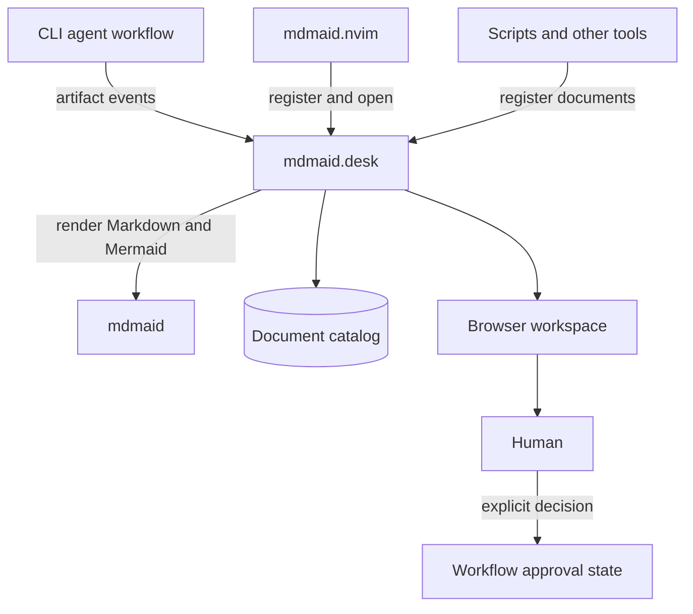

# Mdmaid Project Boundaries and Naming

## Status

Accepted and implemented direction. The workflow product is branded
**AgentnykMaisternia**, its repository is `agentnyk-maisternia`, its CLI is
`maisternia`, and the presentation service is the separate `mdmaid.desk`
repository with the `mdmaid-desk` CLI.

## Decision Direction

The persistent presentation service should be a separate project.

`mdmaid.nvim` demonstrates useful multi-file preview behavior, but it should
not be a dependency of the CLI agent workflow.

The new service should work:

- without Neovim;
- without an active agent session;
- across multiple repositories;
- across multiple CLI agent providers;
- as a persistent local document workspace.

Later, `mdmaid.nvim` may use this same service instead of managing its own
server lifecycle.

## Proposed Project Split



### `mdmaid`

Responsibility:

- Markdown rendering;
- Mermaid rendering;
- reusable rendering APIs;
- low-level preview primitives;
- common styles and assets.

It should not own:

- agent workflow state;
- task approvals;
- provider routing;
- persistent agent artifact policy.

### `mdmaid.desk`

Responsibility:

- persistent local daemon;
- workspace registration;
- document catalog;
- directory watching;
- stable document URLs;
- browser document library;
- document search and grouping;
- CLI and local API;
- secure filesystem boundaries;
- attention indicators.

It should remain useful outside agent workflows. Agents are important document
producers, but the registration API should be generic.

### `mdmaid.nvim`

Responsibility:

- Neovim commands and keymaps;
- registering Markdown buffers;
- opening the matching browser document;
- editor-specific file selection;
- health checks and editor notifications.

It should eventually support two modes:

```text
daemon mode:
  use mdmaid.desk

standalone compatibility mode:
  start the existing per-Neovim preview server
```

In daemon mode:

```text
BufEnter *.md
  -> mdmaid-desk register <file> --workspace <id>
  -> open the returned or existing desk URL when policy requires
```

The Neovim process no longer owns the persistent server.

### CLI Agent Workflow Project

Responsibility:

- provider-neutral workflow commands;
- provider configuration;
- durable task state;
- append-only task history;
- model and runner routing;
- artifact production;
- artifact events;
- presentation policy;
- approval gates;
- execution coordination.

It emits a generic event:

```json
{
  "event": "artifact.produced",
  "task_id": "PROJECT-123",
  "kind": "plan",
  "path": "/absolute/path/to/plan.md",
  "attention": "approval"
}
```

The mdmaid presentation adapter translates that event into:

```text
register document
open when policy requires
return stable URL
```

The workflow project remains the authority for approvals. `mdmaid.desk` is the
human review surface, not the task-state authority.

## Why Not Put Everything in `mdmaid.nvim`

An editor plugin has the wrong lifecycle for agent artifacts:

- agents run without Neovim;
- the editor may close while tasks continue;
- multiple agents may produce documents concurrently;
- documents should remain available after sessions end;
- stable browser links should not depend on an editor PID;
- other editors and scripts should be able to register documents.

The editor plugin is a client. It should not be the presentation platform.

## Why a Separate Repository

The presentation workspace has its own:

- daemon lifecycle;
- persistent state;
- security model;
- web interface;
- CLI and API;
- release cycle;
- testing strategy;
- users beyond the configurator.

Keeping it separate prevents the workflow configurator from becoming a web
server and prevents the renderer from becoming an agent orchestration system.

## Recommended Naming

### Presentation Product

Preferred product name:

```text
mdmaid.desk
```

Technical names:

```text
Git repository: mdmaid.desk
Package:        mdmaid-desk
CLI:            mdmaid-desk
Product/UI:     mdmaid.desk
```

Current CLI shape includes:

```bash
mdmaid-desk daemon start
mdmaid-desk workspace add /path/to/repository --id project-id
mdmaid-desk register plan.md --workspace project-id
mdmaid-desk list --task PROJECT-123
mdmaid-desk web
```

The separate executable avoids coupling the `mdmaid` renderer/validator and
`mdmaid.desk` catalog release cycles.

### AgentnykMaisternia

The workflow product is branded **AgentnykMaisternia**, with **Maisternia** as
the short name.

```text
Product brand:      AgentnykMaisternia
Repository:         agentnyk-maisternia
CLI/state namespace: maisternia
Workflow commands:  /work-brief, /work-plan, /work-run
Presentation:       mdmaid.desk
```

The name covers both the current configuration foundation and the intended
workflow scope:

- manifests and provider targets;
- safe rendering and guarded installation;
- workflow orchestration;
- durable task state;
- artifact events;
- approvals;
- runner selection;
- resumable execution.

## Recommended Suite

```text
mdmaid
  Rendering engine and reusable preview primitives

mdmaid.desk
  Persistent local document workspace and presentation service

mdmaid.nvim
  Optional Neovim client for mdmaid.desk

maisternia
  Provider-neutral workflow, configuration, state, routing, and approvals
```

## Relationship to Human-in-the-Loop Workflow

```text
Agent produces artifact
        |
        v
Workflow records artifact event
        |
        v
mdmaid.desk registers document
        |
        +--> passive artifact: catalog only
        |
        +--> attention required: open browser
                              |
                              v
                         human reviews
                              |
                              v
                    explicit workflow decision
```

Important invariants:

1. Registration does not interrupt the user.
2. Opening does not imply approval.
3. Approval belongs to workflow state.
4. Mdmaid remains usable without the agent workflow.
5. The agent workflow remains usable without mdmaid.
6. Neovim is an optional client, not infrastructure.

## Document Wording Correction

The broader human-in-the-loop proposal should describe `mdmaid.nvim` as a
reference implementation:

> `mdmaid.nvim` validates the multi-file preview model, but is neither required
> by nor responsible for the agent presentation service. `mdmaid.desk`
> generalizes the reusable daemon and catalog layer; `mdmaid.nvim` may become
> one of its clients later.

## Current Boundary

The implemented split is:

```text
repository:   mdmaid.desk
product name: mdmaid.desk
CLI/package:  mdmaid-desk
scope:        daemon, catalog, browser workspace, TUI, CLI/API
renderer:     mdmaid
clients:      agent workflows, scripts, humans, and future editor adapters
```

The generic artifact-event ownership and any workspace-local daemon mode remain
separate design decisions; they do not change the reading-hub contract.
