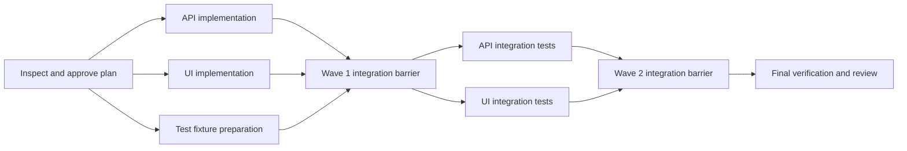

# Parallel Work And The Speed Loop

## Goal

The `parallel-work` preset reduces verified wall-clock delivery time by running
independent implementation tasks concurrently. It does not make every plan
parallel and does not replace dependency ordering, isolation, integration, or
verification.

`agentctl` installs the plan and execution contracts. Codex, Claude,
Antigravity, or Hermes executes them using its native capabilities.

## Commands

The preset installs:

```text
/work-parallel-plan
/work-parallel-run
/work-speed-loop
```

`/work-parallel-plan` produces a dependency graph and execution waves.
`/work-parallel-run` executes one approved graph. `/work-speed-loop` coordinates
both and falls back to sequential work when safe parallelism is unavailable.

## Why A Different Plan Is Required

A normal ordered checklist does not contain enough information to launch
concurrent writers. A parallel plan must define:

- explicit dependencies;
- exclusive write paths;
- shared and protected paths;
- worker authority and isolation;
- per-task acceptance and verification;
- execution waves;
- integration strategy and order;
- verification barriers;
- concurrency, token, attempt, and wall-time limits.

The preset installs `parallel-plan.schema.json` so the harness can preserve this
structure in `.agent-runs/parallel/<run-id>/parallel-plan.json` rather than
recovering it from prose.

## Example Branching



The first three tasks may run together only when their write paths do not
overlap. Wave 2 cannot start until Wave 1 is integrated and verified.

## Decomposition Rules

A task is safe to place in the same wave as another task when:

1. neither depends on the other;
2. their write paths do not overlap, including parent/child paths;
3. they do not mutate the same generated output, manifest, lockfile, migration,
   or shared external state;
4. each has an isolated worktree, branch, or read-only artifact boundary;
5. each can be accepted and verified independently;
6. integration cost is lower than the likely wall-time savings.

Examples of useful parallel slices:

- independent backend and frontend components with an already stable interface;
- implementation and read-only documentation research;
- separate package changes with package-local tests;
- independent test suites after a verified integration barrier;
- multiple read-only investigation or review lanes.

Examples that should remain serialized:

- sequential schema migrations;
- tasks modifying the same API contract before that contract stabilizes;
- dependency and lockfile edits from multiple workers;
- generated-code updates sharing one generator output;
- changes whose tests mutate the same external fixture or service;
- a small task where worker setup costs more than execution.

## Execution Model

The coordinator performs this loop:

```text
VALIDATE APPROVED PLAN
  -> FIND READY TASKS
  -> LIMIT BY CAPABILITY AND BUDGET
  -> LAUNCH ISOLATED WORKERS
  -> COLLECT EVIDENCE
  -> INTEGRATE IN DEPENDENCY ORDER
  -> VERIFY THE COMBINED WAVE
  -> RECOMPUTE READY TASKS
  -> REPEAT OR REPLAN
```

One coordinator owns plan state and integration. Workers receive bounded task
packets and cannot integrate each other, broaden scope, or write outside their
declared paths.

## Isolation And Integration

Concurrent write tasks require separate worktrees or an equivalent isolated
branch mechanism. When that is unavailable, only read-only work may remain
parallel; write work becomes serialized.

Each worker returns:

- task ID and status;
- exact base revision;
- changed files;
- patch, artifact, or explicitly authorized local commit;
- focused checks and results;
- token/time usage when available;
- blockers and uncertainty.

The coordinator rejects undeclared writes and stale bases. Integration uses the
approved patch, cherry-pick, merge, serialized, or artifact-only strategy. A
conflict stops the barrier instead of being resolved by guessing intent.

## Verification Barriers

Focused worker tests are necessary but insufficient because independent diffs
may conflict semantically after integration. Every wave therefore has a barrier:

1. integrate successful worker outputs;
2. run combined checks;
3. classify failures;
4. mark tasks complete only when the barrier passes;
5. release newly ready dependent tasks.

Final repository verification and independent review run after the last wave.

## Current Provider Behavior

The checked-in provider contracts currently imply:

| Provider | Parallel behavior |
|---|---|
| Codex | Parallel read and write tasks when subagents and isolated worktrees are available |
| Claude | Parallel read and write tasks when subagents and isolated worktrees are available |
| Antigravity | Parallel read-only work; serialize writes under the current conservative authority contract |
| Hermes | Preserve the dependency plan but use sequential fallback under the current runner contract |

Antigravity still renders through the legacy `.config/agy` compatibility tree;
that target is not proof of provider-native consumption. Provider capabilities
must be inspected at execution time because the contracts may evolve.

## Speed And Cost

The primary target is verified wall-clock duration, not maximum worker count.
The final report includes:

- sequential baseline estimate;
- critical-path estimate;
- actual elapsed time and concurrency;
- model, token, and tool usage when available;
- coordination, integration, retry, and discarded-work overhead;
- observed speedup and confidence;
- final correctness and verification status.

Parallel execution can spend more tokens while finishing sooner. The report
keeps those tradeoffs separate.

## Safety Boundaries

- The plan requires explicit human approval.
- Concurrent writers require isolation.
- Overlapping writes are serialized.
- Protected paths remain protected for every worker.
- Authority never expands to gain speed.
- Dependents never start from an unverified parent result.
- Integration conflicts stop the wave.
- Failed assumptions return to planning.
- Commits, pushes, PRs, deployments, production access, and destructive actions
  remain separate authorization points.

## Try It

Inspect and plan the preset:

```bash
agentctl preset show parallel-work
agentctl preset plan --target codex parallel-work
```

Apply after reviewing conflicts:

```bash
agentctl preset apply --target codex --yes parallel-work
```

Create a decomposable plan:

```text
/work-parallel-plan <implementation goal and acceptance criteria>
```

After approval, execute it:

```text
/work-parallel-run .agent-runs/parallel/<run-id>/parallel-plan.json
```

Or use the coordinator:

```text
/work-speed-loop <goal or approved parallel plan>
```
