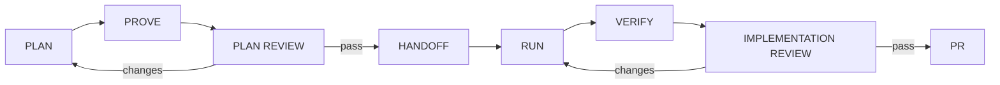

# Multi-Lens Review Workflow

## Purpose

The `multi-lens-review` preset provides one evidence standard for plans,
decision deltas, diffs, pull requests, and implementations. It separates
candidate generation from finding verification and separates read-only review
workers from the coordinator that applies fixes.

`agentctl` installs this workflow. The selected CLI agent harness owns runtime
subagents, provider calls, permissions, edits, and verification.

## Commands

```text
/work-plan-review
/work-review
/work-delegated-review
```

`/codex-review` is the provider-specific convenience alias. It accepts the same
review modes instead of assuming that an implementation diff exists:

```text
/codex-review auto <target or focus>
/codex-review plan <plan or design>
/codex-review plan-delta <changed decision or section>
/codex-review implementation <diff, PR, contract, or focus>
```

An explicit plan, design, contract, or decision delta is reviewable even when
there is no code diff.

## Delivery Gates

The standard delivery DAG now distinguishes the two gates:



`/work-prove` defines acceptance evidence. `/work-plan-review` adversarially
checks whether the plan is correct, complete, internally consistent, grounded
in the current code, and testable. They are complementary gates.

## Plan Lenses

Every plan review runs independent read-only lenses for:

| Lens | Focus |
|---|---|
| Correctness versus code | Paths, symbols, APIs, behavior, and assumptions match the repository |
| Internal consistency | Tasks, dependencies, decisions, terms, and acceptance criteria agree |
| Completeness and edge cases | Failure paths, boundaries, rollout, rollback, and verification |
| Architecture and simplicity | Existing ownership boundaries, coupling, and unnecessary abstraction |
| Best practices | Repository and domain practices without cargo-cult additions |
| Acceptance and testability | Important claims have observable proof |

`plan-delta` reviews remain focused on the changed decision and affected tasks.
The workflow escalates to full plan review only when the delta invalidates wider
scope, interfaces, dependencies, acceptance criteria, or proof.

## Implementation Lenses

Every implementation review runs independent read-only lenses for:

| Lens | Focus |
|---|---|
| Correctness | Behavior, state transitions, invariants, and error handling |
| Consistency | Repository conventions, sibling behavior, names, and contracts |
| Completeness and edge cases | Boundaries, failures, concurrency, cleanup, and recovery |
| Security | Authorization, injection, secrets, privacy, data exposure, and unsafe defaults |
| Architecture | Ownership, layering, coupling, compatibility, and system consequences |
| Simplicity and DRY | Duplication and needless complexity without premature abstraction |
| Diff analysis | Unintended changes, generated output, migrations, and scope drift |
| Dependency currency | New direct dependencies, non-latest choices, touched sibling dependencies, advisories, and compatibility |
| Tests and verification | Missing assertions, wrong test level, weak evidence, flakes, and failure paths |

Dependency-currency findings require lockfile evidence and an official registry
or primary project source. The reviewer cannot declare a dependency stale from
model memory or recommend an upgrade without compatibility evidence.

## Domain Lenses

Add domain lenses only when the affected surface warrants them:

- accessibility for user interfaces and interaction changes;
- privacy, PII, and SOC 2 evidence for sensitive or audited data flows;
- performance and scalability for latency, throughput, memory, storage, or
  concurrency risk;
- migration safety for schema, data, dependency, protocol, rollout, and
  compatibility changes;
- API compatibility, data integrity, or observability where relevant.

A generic practice is not proof of compliance. Compliance findings must cite
the repository's actual requirements and evidence.

## Reviewer And Verifier Model

Each lens receives a bounded read-only packet and must inspect the actual code.
A diff, summary, or builder transcript is not enough. Every candidate includes:

- severity;
- claim and impact;
- proposed minimal fix;
- concrete `file:line`, short verbatim quote, reproducible command/test, or
  authoritative-document evidence.

Each candidate then goes to a separate verifier whose first objective is to
refute it. The verifier returns `is_real`, `grounded`, rationale, evidence, and
corrected severity. A finding survives only when:

```text
is_real && grounded
```

The coordinator records refuted candidates and why, deduplicates surviving
findings, and ranks them Critical, High, Medium, then Low.

## Report And Apply

Review workers and verifiers never edit. The coordinator:

1. writes the initial review report;
2. applies every confirmed fix within approved scope;
3. edits a plan/design for plan findings or code/tests for implementation
   findings;
4. marks decision-dependent, unauthorized, or out-of-scope fixes blocked;
5. runs focused checks and repository-required final verification;
6. reruns affected lenses when a repair materially changes behavior.

Critical and High findings are blocking. The gate passes only when confirmed
fixes are applied and verification succeeds. Every run writes:

```text
.agent-runs/reviews/<run-id>/review.md
.agent-runs/reviews/<run-id>/review.json
```

The JSON report conforms to `review-report.schema.json` and preserves provider
attribution, confirmed and refuted findings, applied or blocked fixes, checks,
counts, and final gate status.

An external `pull_request.opened` event enters the separate read-only
`review-intake` phase. It may produce and verify findings, but it cannot apply
changes until a user or trusted coordinator explicitly starts the write-capable
review phase.

## Native And Cross-Provider Delegation

Normal review uses native subagents when the current harness supports them and
runs the same lenses sequentially otherwise. Cross-provider review is explicit:

```text
/work-delegated-review mode=implementation \
  providers=codex,claude,antigravity <target>
```

Naming providers approves the disclosed, redacted packet for that run. Before
dispatch, the coordinator shows the providers, shared files or excerpts,
sensitive categories, and expected budget. Expanding disclosure requires a new
decision.

Current conservative behavior is:

| Provider | Automatic delegated behavior |
|---|---|
| Codex | Ephemeral read-only execution or native subagents |
| Claude | Plan permission with read-only tools or native subagents |
| Antigravity (`agy`) | Plan mode with sandbox; text result |
| Hermes | Interactive only |

Hermes one-shot mode bypasses dangerous-operation approvals, so the checked-in
adapter does not permit unattended headless delegation. No workflow may widen
authority or use dangerous bypass flags to obtain provider diversity.

For high-risk findings, use a verifier from a different selected provider when
available. Agreement between models is not proof; evidence and successful
refutation determine whether a finding survives.

## Install

Inspect and apply only the review bundle:

```bash
agentctl preset show multi-lens-review
agentctl preset plan --target all multi-lens-review
agentctl preset apply --target codex --yes multi-lens-review
```

Applying may surface a conflict for an existing personal `lens-review` skill.
Use the normal agentctl conflict decision flow to inspect and explicitly keep or
replace it.
