# Multi-Lens Review Workflow

## Purpose

The `multi-lens-review` preset provides one evidence standard for plans,
decision deltas, diffs, pull requests, and implementations. It separates
candidate generation from finding verification and separates read-only review
workers from the coordinator. In the default `repair` disposition the
coordinator applies verified fixes; in `report-only` it must not modify the
reviewed implementation or contributor branch.

Implementation reviews can select a focused `maintainability` profile. It
looks harder for duplicated knowledge, avoidable complexity, weak abstractions,
and grounded best-practice violations while requiring proof that observable
behavior remains unchanged.

The specialized AI-generated test review is defined in
[Specialized Test Review](TEST-REVIEW.md). It extends the existing
implementation-review gate rather than add another human approval gate.

`maisternia` installs this workflow. The selected CLI agent harness owns runtime
subagents, provider calls, permissions, edits, and verification.

## Commands

```text
/work-plan-review
/work-review
/work-review-simplify <target or focus>
/work-test-review <target or focus>
/work-test-review authoring <change or proposed tests>
/work-test-review audit <test area>
/work-test-review campaign <subsystem>
/work-review implementation --scope tests <target or focus>
/work-review implementation --profile maintainability <target or focus>
/work-review implementation --disposition report-only <PR or diff>
/work-review implementation --allow-degraded <target or focus>
/work-review @agy @codex @claude -- implementation <target or focus>
```

`/work-review` accepts `auto`, `plan`, `plan-delta`, and `implementation`. An
explicit plan, design, contract, or decision delta is reviewable even when
there is no code diff. The default profile is `standard`; `maintainability`
applies only to implementation targets.

The default disposition is `repair`: the coordinator applies independently
confirmed fixes within approved scope and verifies them. `report-only` keeps
the reviewed implementation and contributor branch read-only while producing
the same grounded, independently verified findings. `/work-start-pr-review`
uses report-only whenever feedback will be published to an existing PR.

`/work-review-simplify` is a thin alias for `/work-review implementation
--profile maintainability`. It reads the canonical review workflow rather than
duplicating its lenses, verification, repair, or authority rules.

`/work-test-review` is a thin alias for `/work-review implementation --scope
tests`. Full implementation review embeds the same specialized bundle; the
standalone command limits candidate generation to test evidence without
creating a separate review engine or human gate.

Its default test mode is `review`. Explicit `authoring` mode gates new or
changed tests, including a pre-fix failing control for bug regressions. `audit`
mode examines a bounded area for duplicated or false assurance and obsolete
test-only production seams. `campaign` mode exhaustively inventories one named
subsystem, assigns every declaration to a production-owner lane, preserves one
primary owner per contract, and independently verifies that removals did not
erase its only proof. These modes reuse the canonical disposition, verifier,
repair, and reporting machinery.

## Delivery Gates

The standard delivery DAG now distinguishes the two gates:

```mermaid
flowchart LR
    PLAN[PLAN] -->|expanded proof needed| PROVE[PROVE]
    PLAN -->|proof included or not needed| CHOICE{AI REVIEW CHOICE}
    PROVE --> CHOICE
    CHOICE -->|run AI review now| PLANREVIEW[PLAN REVIEW]
    CHOICE -->|skip AI review| PRESENT[PUBLISH FINAL PLAN]
    CHOICE -->|review later| PAUSE[PAUSE]
    PLANREVIEW -->|pass| PRESENT
    PLANREVIEW -->|changes| PLAN
    PRESENT --> WAIT[FOREGROUND WAIT ON MDMAID.DESK]
    WAIT --> DECIDE{HUMAN DECISION + TEXT}
    DECIDE -->|changes| PLAN
    DECIDE -->|approved| READY[READY]
    READY -->|new executor| HANDOFF[HANDOFF]
    READY -->|continuous session| RUN[RUN]
    HANDOFF --> RUN
    RUN --> VERIFY[VERIFY]
    VERIFY --> IMPLREVIEW[IMPLEMENTATION REVIEW]
    IMPLREVIEW -->|pass| CHANGE[CHANGE REVIEW AND HUMAN APPROVAL]
    IMPLREVIEW -->|changes| RUN
    CHANGE -->|approved and publication requested| PR[PR]
    CHANGE -->|changes requested| RUN
```



When required, `/work-direction` first records the architectural decisions
that constrain the implementation plan. It then asks whether to run AI review
now, skip AI review, or review later. Only the first choice invokes
`/work-plan-review direction`; a skip proceeds directly to the revision-bound
human direction decision and is not approval. Small local work can bypass the
direction gate with an evidence-backed reason. See
[Architectural direction](ARCHITECTURAL-DIRECTION.md).

The plan contains the normal acceptance contract. `/work-prove` expands it only
when risk requires more detailed evidence. After the plan is ready, the human
chooses whether to run AI review now, skip it, or review later. The workflow
does not invoke review or its candidate-verification workers automatically.
When selected, `/work-plan-review` adversarially checks whether the plan is
correct, complete, internally consistent, grounded in the current code, and
testable.

After selected review passes, or after an explicit AI review skip, the exact
final plan revision is validated and delivered through mdmaid.desk with an
explicit `plan-decision` request. Passive documents
still have no workflow actions. The installed `readable-output` skill is the canonical quiet-wait contract.
The producer records the request ID and exact
revision, keeps its current agent turn open on the foreground waiter, and
receives both the human outcome and response text. The initial update must
include the review request ID, exact document revision, and an available
mdmaid.desk link or navigation route. A yielded execution-process ID must be
resumed until completion with the longest safe blocking interval allowed by
active harness policy; it is not a reason to finish the turn. The producer keeps one
long-lived foreground waiter, never starts a replacement or nested waiter, and
reports only for material state changes, a waiter failure or required
intervention, an explicit user status request, or the final durable result.
Do not narrate unchanged pending checks.
`waiting_for_approval` is an intermediate status only. As soon as the waiter
returns, the producer surfaces the decision and text and continues the mapped
workflow without requiring another chat message. Presentation, opening, and
reading do not imply approval. The human approves, requests changes, or rejects
the exact content hash; only an approved revision can pass `READY`. Requested
changes return to planning and the review choice, rejection stops or reshapes
the work, and a stale request requires publication of the current revision and
a new review choice. `HANDOFF` is required
only when execution moves to a fresh agent, provider, worktree, or later
session.

## Plan Lenses

Every plan review runs independent read-only lenses for:

| Lens | Focus |
|---|---|
| Correctness versus code | Paths, symbols, APIs, behavior, and assumptions match the repository |
| Internal consistency | Tasks, dependencies, decisions, terms, and acceptance criteria agree |
| Completeness and edge cases | Failure paths, boundaries, rollout, rollback, and verification |
| Architecture and simplicity | Existing ownership boundaries, coupling, and unnecessary abstraction |
| Best practices | Repository and domain practices without cargo-cult additions |
| Acceptance and testability | Important claims have observable proof |

The architecture-and-simplicity lens challenges proposed features,
dependencies, configuration, layers, abstractions, and new files before code is
written. It prefers YAGNI, existing repository behavior, the standard library,
native platform capabilities, installed dependencies, and direct control flow
in that order. A simpler plan remains valid only when it preserves the accepted
behavior and safeguards; a material scope or design change returns to the human
decision gate.

`plan-delta` reviews remain focused on the changed decision and affected tasks.
The workflow escalates to full plan review only when the delta invalidates wider
scope, interfaces, dependencies, acceptance criteria, or proof.

When selected and passing, `/work-plan-review` builds a standalone visual
`plan-review.md` containing the complete reviewed plan. It selects only
applicable Mermaid architecture/data-flow, class, entity-relationship, state,
sequence, dependency, and requirement lenses. Planned interfaces and relations
are labelled proposed rather than verified, then the exact artifact is bound to
the existing `plan-decision` gate.

## Implementation Lenses

Every implementation review runs independent read-only lenses for:

| Lens | Focus |
|---|---|
| Correctness | Behavior, state transitions, invariants, and error handling |
| Consistency | Repository conventions, sibling behavior, names, and contracts |
| Completeness and edge cases | Boundaries, failures, concurrency, cleanup, and recovery |
| Security | Authorization, injection, secrets, privacy, data exposure, and unsafe defaults |
| Architecture | Ownership, layering, coupling, compatibility, and system consequences |
| Simplicity and DRY | Duplication and needless complexity without premature abstraction |
| Diff analysis | Unintended changes, generated output, migrations, and scope drift |
| Dependency currency | New direct dependencies, non-latest choices, touched sibling dependencies, advisories, and compatibility |
| Specialized test review | Intent and oracles, risk and edge coverage, level and fidelity, redundant assurance, maintainability, and diagnostics |

Dependency-currency findings require lockfile evidence and an official registry
or primary project source. The reviewer cannot declare a dependency stale from
model memory or recommend an upgrade without compatibility evidence.

The specialized test bundle maps material changed behaviors and failure risks
to accepted sources, the cheapest faithful test level, scenarios, observable
oracles, distinct assurance, and residual risk. Coverage, mutation score, test
count, and line count remain contextual evidence rather than universal gates.
See [Specialized Test Review](TEST-REVIEW.md) for the full contract.

## Maintainability Profile

`--profile maintainability` runs every implementation lens, adds a grounded
best-practices lens, and intensifies correctness, consistency, architecture,
simplicity/DRY, and test verification. Before suggesting a change, reviewers
record the behavior contract that must be preserved: outputs, side effects,
errors, ordering, compatibility, and covered failure paths.

The profile looks specifically for:

- duplicated knowledge or repeated decision logic, not merely similar-looking
  code;
- unnecessary branches, state, indirection, configuration, or abstractions;
- ownership boundaries that create coupling or scatter one responsibility;
- deviations from repository rules, established neighboring patterns, or
  authoritative technical guidance.

Every candidate explains its evidence, minimal fix, net simplification,
regression risk, and verification plan. A proposed abstraction must remove
repeated knowledge or reduce coupling and concepts. Single-use generic helpers,
speculative reuse, style-only preferences, and abstractions that merely move
complexity are refuted. `NO_FINDINGS` remains valid when the current solution
is already the simplest behavior-preserving design supported by the evidence.

The profile must prove that it inspected four structural obligations instead of
using `NO_FINDINGS` as an unexamined default:

| Obligation | Owning lenses | Required inspection |
|---|---|---|
| `alternative-comparison` | Simplicity and DRY | A concrete earlier simplification rung, introduced concepts/state/branches/layers, forwarding wrappers, important consumers, and preserved safeguards |
| `contract-coherence` | Consistency and architecture | Base, implementation, caller, and extension contracts; nullability; type-shape burden; and concrete behavior leaking into generic boundaries or documentation |
| `error-and-validation-flow` | Correctness and architecture | Representative success/failure paths, validation and conversion hops, error translation, distinct recovery behavior, and ownership |
| `runtime-invariant-placement` | Correctness | Caller-controlled failures versus developer-only invariants, value origin, reachability, repeated operational checks, and preserved failure semantics |

Each obligation is recorded as `clear`, `candidate`, `unknown`, or
`not-applicable`, with evidence, rationale, linked finding IDs, and any missing
evidence. `unknown` prevents a pass. `NO_FINDINGS` is valid only when all four
are `clear` or `not-applicable` with supporting evidence. Under repair
disposition, a candidate can pass only after its linked findings are refuted or
confirmed fixes are applied and verified. Under report-only disposition, a
candidate can pass after every linked finding is independently resolved and
confirmed fixes are recorded as `not-applicable`; this completes the review,
not implementation approval. Existing internal structure is evidence rather
than an automatic behavior contract; public and extension compatibility still
constrain changes.

### Simplification Decision Ladder

After the reviewer establishes the behavior contract, it evaluates options in
order and stops at the first behavior-preserving option that fully satisfies
the contract:

1. apply YAGNI: skip or delete behavior and structure that is not required;
2. reuse an established repository abstraction, helper, or pattern;
3. use the active language's standard library;
4. use a native platform capability from the browser, database, operating
   system, framework, or protocol;
5. use an already-installed dependency with a compatible reviewed contract;
6. use straightforward local code and direct control flow;
7. introduce or retain an abstraction only when it removes proven repeated
   knowledge, creates clear ownership, or materially reduces coupling.

An earlier fit wins only when it preserves required security, validation,
accessibility, data-loss prevention, errors, compatibility, and verification.
The reviewer does not continue down the ladder merely to find a shorter option.
A line count can support a net-simplification estimate, but it cannot be the
sole decision metric.

Applicable simplification findings record one kind:

| Kind | Meaning |
|---|---|
| `delete` | Remove behavior or code with no accepted requirement |
| `reuse` | Replace a duplicate with existing repository-owned behavior |
| `stdlib` | Replace custom behavior with the active language's standard library |
| `native` | Use a platform, framework, database, OS, browser, or protocol capability |
| `dependency` | Reuse an already-installed, reviewed dependency |
| `yagni` | Remove speculative behavior, configuration, layers, or abstractions |
| `shrink` | Express the same behavior with more direct local control flow |

The kind is a triage field, not a substitute for severity, evidence,
behavior-preservation proof, or independent refutation.

### Comment Simplification

Comments are maintainability assets when they preserve irreducible rationale;
they are not automatically valuable documentation or automatically wasteful
lines. Reviewers keep comments that explain non-obvious local decisions,
invariants and trust boundaries, compatibility or safety constraints, and
deliberate limitations or upgrade paths that the implementation cannot express.

The reviewer first asks whether names, types, assertions, tests, or clearer
structure can express the same fact. Useful but verbose prose is shortened to
the constraint and consequence. Cross-cutting tradeoffs and decision history
move to durable documentation, with a short local pointer when discoverability
matters.

The existing simplification kinds describe the proposed treatment:

| Comment case | Kind | Treatment |
|---|---|---|
| Narration, stale prose, or commented-out code | `delete` | Remove information that is redundant, misleading, or recoverable from version control |
| Useful but verbose local rationale | `shrink` | Retain the constraint and consequence close to the code |
| Cross-cutting or duplicated rationale | `reuse` | Centralize it in durable documentation and leave a local pointer if needed |
| Speculative future guidance | `yagni` | Remove guidance for an unaccepted future requirement |

A reviewer must show a concrete maintainability cost; comment volume and line
count alone are insufficient. Security, validation, accessibility, data-loss,
and compatibility rationale stays in place until an equally durable equivalent
exists.

### Language And Tool Discovery

The maintainability profile is language-agnostic. Before choosing best
practices or verification checks, it discovers the languages, frameworks,
build systems, and generated surfaces that are material to the target. It uses
repository instructions, CI and hook configuration, build and package
manifests, lockfiles, source and generated-file markers, and the changed paths.

This is evidence-led heuristic discovery, not a deterministic lookup table.
The review records `detected`, `mixed`, or `unknown`, along with its evidence,
confidence, and remaining ambiguity. A file extension by itself is not enough,
and a multi-language change is evaluated per affected surface. Unknown context
stays unknown rather than being replaced by a familiar ecosystem assumption.

Verification starts with repository-owned commands declared by instructions,
CI, hooks, or build configuration. Relevant tools that are already available
may provide supplementary evidence, but the workflow does not install tools,
enable services, access the network, or promote a remembered convention into a
required gate without approval and authoritative support. The exact commands,
selection rationale, and results are recorded for reproducibility.

### jscpd And GitNexus Evidence

The usual canonical maintainability invocation automatically discovers and
uses approved local analyzer capabilities:

```text
/work-review implementation --profile maintainability <target or focus>
```

`/work-review-simplify` expands to that command. Supplementary analysis is not
run for plan review, test-only scope, or the default `standard` implementation
profile. Review execution never installs or upgrades a tool.

The default tool policy is `advisory`. A missing or unusable analyzer is visible
in the report but does not by itself block review. Repository-owned policy may
set a tool to `disabled` or `required`; a required unavailable or failed tool
makes affected inspections `unknown` and blocks a maintainability pass.

For jscpd, the approved executable is version `5.3.2`. The workflow verifies
`jscpd --version`, prefers repository-owned configuration, and otherwise writes
temporary invocation configuration only beneath the task-owned review evidence
directory. It collects bounded JSON evidence for exact and normalized clones,
explicitly enabled supported near-miss detection, complexity, and supported
dead-code analysis. It uses a locally available base ref to distinguish new
from legacy duplication. A valid scan with zero candidates is different from a
failure or a scan that analyzed zero applicable files. Duplication percentages,
thresholds, and health scores are supporting context, never findings or gates.

GitNexus enrichment reuses the existing repository-bounded installation,
configuration, and index. It records repository identity, snapshot
correspondence, index freshness, supported relationships, and missing surfaces
before querying bounded symbols, callers, dependencies, implementations,
processes, tests, related code, and impact. It does not create a second graph or
silently refresh a stale index. An absent edge is never proof that a runtime
relationship does not exist.

Analyzer matches are grouped into bounded candidate families. Similarity,
repeated responsibility, and safety of sharing remain separate judgments.
Every family goes through the applicable canonical lenses and independent
refutation before it can become a finding. Report-only review preserves all
reviewed source; repair review reruns affected analyzer passes after confirmed
coordinator-owned changes.

Raw and normalized jscpd evidence stays under:

```text
.agent-runs/reviews/<run-id>/evidence/jscpd/
```

Source excerpts are bounded, repositories are treated as untrusted input, and
parsing does not authorize builds, scripts, hooks, generators, package lifecycle
steps, binaries, network access, or dependency downloads.

The alias also accepts normal routing syntax:

```text
/work-review-simplify @agy @codex @claude -- <target>
```

## Domain Lenses

Add domain lenses only when the affected surface warrants them:

- accessibility for user interfaces and interaction changes;
- privacy, PII, and SOC 2 evidence for sensitive or audited data flows;
- performance and scalability for latency, throughput, memory, storage, or
  concurrency risk;
- migration safety for schema, data, dependency, protocol, rollout, and
  compatibility changes;
- API compatibility, data integrity, or observability where relevant.

A generic practice is not proof of compliance. Compliance findings must cite
the repository's actual requirements and evidence.

## Reviewer And Verifier Model

The coordinator creates one evidence packet, then dispatches independent subject
lanes in bounded parallel waves. Full implementation, plan, and direction review
uses at least three reviewer workers; tests-only review uses at least two. The
default implementation subjects are behavior/correctness, design/coherence,
trust/runtime, change scope, test intent/risk, and test fidelity/economy. Related
lenses may share one subject worker, but unrelated subjects are not collapsed to
save calls.

Each lane receives a bounded read-only packet and must inspect the actual code.
A diff, summary, or builder transcript is not enough. Every candidate includes:

- severity;
- claim and impact;
- proposed minimal fix;
- concrete `file:line`, short verbatim quote, reproducible command/test, or
  authoritative-document evidence.

Each candidate then goes to a separate verifier worker that did not originate
the candidate. Its first objective is to refute it. The verifier returns
`is_real`, `grounded`, rationale, evidence, and corrected severity. A finding
survives only when:

```text
is_real && grounded
```

Before the gate is assigned, the coordinator also checks execution
relationships that JSON shape validation cannot prove: worker IDs are unique,
wave membership is exact, every lens and verification references a declared
complete worker with the required role, and a verifier differs from the
originating reviewer. A failed relationship check blocks the review.

Degraded sequential review does not waive verifier independence. When no
distinct verifier is available, the candidate remains `unverified`, no proposed
fix is applied, and the gate is `blocked` rather than self-verified.

The coordinator records refuted candidates and why, deduplicates surviving
findings, and ranks them Critical, High, Medium, then Low.

## Report, Then Repair Or Return Feedback

Review workers and verifiers never edit. Repair disposition lets the coordinator:

1. writes the initial review report;
2. applies every confirmed fix within approved scope;
3. edits a plan/design for plan findings or code/tests for implementation
   findings;
4. marks decision-dependent, unauthorized, or out-of-scope fixes blocked;
5. runs focused checks and repository-required final verification;
6. reruns affected lenses when a repair materially changes behavior.

In repair disposition, Critical and High findings are blocking. The gate passes
only when confirmed fixes are applied and verification succeeds.

Report-only disposition never edits the reviewed artifact. It records confirmed
fixes as `not-applicable` and may pass when the requested review, independent
verification, deduplication, and safe checks complete. That pass means the
review process completed; it is not implementation approval or merge readiness.

Every run writes:

```text
.agent-runs/reviews/<run-id>/review.md
.agent-runs/reviews/<run-id>/review.json
```

The JSON report conforms to schema version 6 of `review-report.schema.json` and preserves provider
attribution, confirmed and refuted findings, applied or blocked fixes, checks,
counts, and final gate status. It also records execution mode, coordinator,
worker identities and runtimes, assignments, waves, whether the scoped minimum
was met, and any fallback reason. Every lens and verifier references its worker.
Implementation reports include the specialized
`test_evidence` matrix and `test_review_mode`; standalone test reviews record
`scope: tests`. Authoring reports add `test_authoring_gates`, audit and campaign
reports add `test_audit_candidates`, and campaigns add `test_campaign`.
Maintainability reports additionally include the four required
`maintainability_inspections` records, analyzer provenance in
`analysis_tool_evidence`, and correlated `maintainability_candidates`. Version
6 requires `profile`, `scope`, `test_review_mode`, `test_evidence`, and
`disposition` for implementation reports. It keeps the established core fields
and meanings but is explicit because the
strict schema rejects unknown fields. Consumers must branch on
`schema_version`; version 4 is the pre-analyzer contract, version 5 is the
analyzer-evidence contract without execution provenance, and existing artifacts
are not rewritten. Version 1, 2, 3, 4, or 5 reports must be regenerated before
they can satisfy the current gate.

An external `pull_request.opened` event enters the separate read-only
`review-intake` phase. It may produce and verify findings, but it cannot apply
changes until a user or trusted coordinator explicitly starts the write-capable
review phase.

## Native And Cross-Provider Delegation

Normal review requires native subagents when the current harness exposes them.
If advertised spawning fails, the review blocks instead of silently becoming a
single-agent review and records `multi-agent-incomplete`. Sequential execution
is available only through explicit `--allow-degraded`; the report records
`degraded-sequential` and the gate is never `pass`. It is `degraded` only when
the review otherwise completes, `fail` when checks or evidence are invalid, and
`blocked` when required evidence or independent verification is unavailable. The shared
`work-routing` skill selects cross-provider reviewers:

```text
/work-review @agy @codex @claude -- implementation <target>
```

The route defaults to `parallel-verify`. Each selected harness receives an
independent read-only lens packet, and the current harness remains coordinator.
External workers and native same-harness subagents fill one subject graph;
routing does not duplicate already assigned lanes.
The router owns provider eligibility, redaction, disclosure, authority, budget,
and unavailable-target behavior; the review workflow owns lens assignment,
finding refutation, synthesis, and fixes.

Naming harnesses approves the listed targets and minimal disclosed packet for
that run. The routing receipt expands to show shared files or excerpts,
sensitive categories, and expected budget when material. Expanding disclosure
or granting workspace-write requires a new decision. No workflow may widen
authority or use dangerous bypass flags to obtain provider diversity.

For high-risk findings, use a verifier from a different selected provider when
available. Agreement between models is not proof; evidence and successful
refutation determine whether a finding survives.

## Install

Inspect and apply only the review bundle:

```bash
maisternia preset show multi-lens-review
maisternia preset plan --scope user --target all multi-lens-review
maisternia preset apply --scope user --target codex --yes multi-lens-review
```

Applying may surface a conflict for an existing personal `lens-review` skill.
Use the normal maisternia conflict decision flow to inspect and explicitly keep or
replace it.

jscpd installation is a separate operator-controlled action:

```bash
maisternia environment plan maintainability-review
maisternia preset apply --yes maintainability-review-tools
# Equivalent direct pack command:
maisternia environment install --yes maintainability-review
```

The plan displays the pinned `npm install --global jscpd@5.3.2` argument array.
Without explicit confirmation no package command runs. GitNexus remains owned by
the existing `developer-context` environment pack and is not duplicated here.
