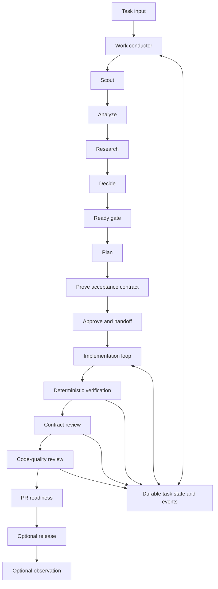

# Improved CLI Agent Workflow

## Status

This document defines the target workflow for `agentctl`.

The current implementation provides the configuration manifest, safe rendering
and apply foundation, canonical phase prompts, and initial provider aliases.
Durable task state and dynamic runner dispatch are the next major milestones.

## Purpose

The workflow should let a user manage many tickets, repositories, terminals, and
agent sessions without having to remember:

- what each task is about;
- what has already happened;
- which decisions were made;
- whether implementation is approved;
- which runner performed each phase;
- where a long-running loop stopped;
- what should happen next.

The same workflow should support:

- bugs;
- features;
- refactors;
- investigations;
- operational work;
- existing repositories;
- new projects.

## Design Principles

### Commands Describe Work, Not Providers

Canonical commands use the `/work` namespace:

```text
/work
/work-brief
/work-scout
/work-analyze
/work-research
/work-decide
/work-ready
/work-plan
/work-prove
/work-handoff
/work-run
/work-verify
/work-review
/work-pr
/work-showcase
/work-cleanup
```

The command identifies the phase. Routing policy decides which runner performs
it.

### Provider Aliases Remain First-Class

Provider-prefixed commands are useful when the user wants an explicit runner:

```text
/codex-plan
/codex-research
/codex-work-loop
/codex-review
/codex-brief
```

These are permanent aliases. They force Codex while preserving the same
canonical phase semantics.

Optional aliases such as `/claude-plan` or `/agy-research` can be added when
there is a recurring need. The repository should not generate every possible
provider and phase combination.

### Durable Files Are Workflow Memory

Chat history is useful context, but it is not the workflow's source of truth.

Every task should have durable state and append-only history so a new session or
different provider can resume without asking the user to reconstruct the work.

### Proof Comes Before Implementation

An implementation plan is not ready until its important behavior can be
verified. Each task needs observable acceptance criteria, including the most
likely error path.

### Deterministic Checks Come Before Agent Judgment

Builds, tests, linters, typecheckers, browser actions, and measurable outputs
are stronger evidence than an agent saying that work looks correct.

### The Builder Does Not Get the Final Vote

Contract compliance and code quality should be reviewed with fresh context,
preferably by a different runner or model from the builder.

### Authority Never Expands Silently

Changing models or providers must not silently broaden:

- filesystem access;
- network access;
- tool access;
- destructive authority;
- production access;
- permission to commit, push, or open a PR.

## End-to-End Flow



Plain-text fallback:

```text
input
  -> scout
  -> analyze
  -> research
  -> decide
  -> ready
  -> plan
  -> prove
  -> approve and handoff
  -> run
  -> verify
  -> contract review
  -> code review
  -> PR readiness
  -> optional release and observation
```

## The Work Conductor

`/work` is the main entry point.

It should:

1. infer the task from explicit arguments, ticket, branch, worktree, repository,
   PR, or current session;
2. read durable task state;
3. summarize current status;
4. detect stale or missing artifacts;
5. recommend one next phase;
6. check approvals;
7. select a runner through policy or explicit override;
8. execute or offer the next phase;
9. record the result and next action.

The conductor does not perform every phase itself. It coordinates specialized
phase prompts and preserves lifecycle rules.

## Phase Contracts

### Brief

Purpose: remind the user what the task is and where it stands.

Inputs:

- durable task state;
- event history;
- current conversation;
- repository, branch, and Git status;
- explicitly referenced artifacts.

Output:

- task identity;
- plain-language goal;
- current phase and status;
- short history;
- important files;
- next step;
- open questions.

This is intentionally different from the initial task definition artifact.

### Scout

Purpose: gather facts before interpretation.

Inputs may include:

- ticket text;
- logs and errors;
- screenshots;
- URLs;
- repository instructions;
- code;
- build and CI configuration.

Output separates:

- facts;
- inferences;
- unknowns;
- scope boundaries;
- likely affected systems;
- missing evidence.

### Analyze

Purpose: produce a crisp task definition.

For bugs:

- observed behavior;
- expected behavior;
- reproduction evidence;
- impact;
- likely root-cause areas.

For features:

- user or business goal;
- current behavior;
- desired behavior;
- scope exclusions;
- constraints;
- draft acceptance criteria.

### Research

Purpose: compare viable solution directions.

Research starts inside the repository. External research is used for current
library behavior, APIs, standards, and provided references.

Output includes:

- options;
- tradeoffs;
- recommendation;
- rejected directions;
- risks;
- user decisions;
- verification implications.

Consequential decisions may use multiple independent runners.

### Decide

Purpose: turn an accepted recommendation into a durable decision.

The decision records:

- chosen approach;
- reasoning;
- rejected options;
- accepted constraints;
- assumptions;
- accepted risk;
- open questions.

An agent recommendation is not a user-approved decision until confirmation is
recorded.

### Ready

Purpose: prevent premature planning or implementation.

The gate checks:

- clear task statement;
- evidence separated from assumptions;
- scope and exclusions;
- acceptance criteria;
- chosen direction;
- repository rules;
- resolved or accepted risks;
- required approval.

Critical ambiguity blocks implementation unless the user explicitly accepts the
risk.

### Plan

Purpose: create an actionable implementation specification.

Tasks should:

- follow dependency order;
- describe observable behavior;
- fit one focused implementation pass;
- identify risk;
- keep the project runnable;
- include a thin end-to-end slice when appropriate.

The plan identifies likely files, migration concerns, expected verification, and
stop conditions.

### Prove

Purpose: create the acceptance contract before coding.

Each task defines:

- setup;
- action;
- observable result;
- error path;
- evidence source;
- verification tier;
- likely test location or command.

Verification tiers:

| Tier | Purpose | Default timing |
|---|---|---|
| Offline deterministic | Logic, validation, formatting, fixtures | Every relevant pass |
| Gated live integration | Real external systems with controlled fixtures | Stage boundaries |
| End-to-end smoke | Real wiring through CLI, API, or browser | Each relevant stage |
| External canary | Detect outside-world changes | Never automatically fix local code |

The phase also defines a concise component-level contract for the most important
end-to-end behavior.

### Handoff

Purpose: compile a self-contained execution contract.

It contains:

- task definition;
- accepted decision;
- plan;
- proof contract;
- repository rules;
- verification commands;
- guardrails;
- worktree and branch;
- retry and parking behavior;
- stop conditions;
- approval boundaries;
- progress and event paths.

A fresh runner should be able to execute the handoff without seeing the original
chat.

### Run

Purpose: implement approved tasks in restartable passes.

Each pass:

1. reads durable progress;
2. selects one unfinished unblocked task;
3. reconfirms current code and rules;
4. implements only that task;
5. adds or updates tests;
6. runs the task criteria and focused checks;
7. records the result and attempt;
8. repeats.

Default circuit breakers:

- park a task after three failed verification attempts;
- stop after three parked tasks;
- stop when every remaining task is blocked;
- stop at configured pass, time, or spend limits.

These defaults are configurable and must respect repository policy.

### Verify

Purpose: run the repository's real quality gates.

Verification families:

- build;
- format and lint;
- typecheck and static analysis;
- unit tests;
- integration tests;
- end-to-end tests;
- security and secrets scan;
- migration checks;
- repository-specific impact analysis.

Run focused checks first and broaden with risk. Preserve full logs and classify
failures.

### Review

Purpose: independently assess contract compliance and code quality.

Contract review asks:

- Does the promised behavior actually exist?
- Can the acceptance evidence be reproduced?
- Were criteria weakened or skipped?
- Do error paths behave correctly?

Code review asks:

- Are there bugs or regressions?
- Are security boundaries preserved?
- Are tests sufficient?
- Are migration and deployment risks handled?
- Does the change follow repository conventions?

Findings lead, ordered by severity and supported by evidence.

### PR

Purpose: check whether the branch is ready for a pull request.

The phase discovers:

- provider;
- base branch;
- commit conventions;
- title and body rules;
- CI and hook requirements.

It checks for:

- uncommitted or untracked files;
- secrets and local settings;
- inaccurate test claims;
- missing docs;
- unresolved findings;
- branch tracking problems.

Commit, push, and PR creation remain explicit user actions.

### Showcase

Purpose: create a readable standalone report for review, handoff, or approval.

It may include:

- executive summary;
- status;
- findings;
- decision;
- plan;
- architecture diagram;
- risks;
- approvals;
- next steps;
- sources.

### Cleanup

Purpose: list temporary artifacts and offer safe cleanup.

Cleanup is always a dry run first. Durable state, decisions, contracts, source
files, credentials, and local environment files are never automatic candidates.

## Durable Task State

Recommended personal location:

```text
~/.agent-workflow/tasks/<task-id>/
  state.yaml
  events.jsonl
  definition.md
  decision.md
  plan.md
  contract.md
  handoff.md
  progress.yaml
  review.md
  reports/
  logs/
```

### State and History

`state.yaml` stores current canonical state.

`events.jsonl` stores append-only history:

- phase started;
- runner selected;
- artifact produced;
- approval granted;
- task attempt passed or failed;
- work parked;
- review completed;
- PR created.

The event stream lets the system reconstruct what happened without trusting a
mutable summary.

### Suggested State

```yaml
schema_version: 1
task_id: PROJECT-123
title: Short task name
repository: /absolute/path/to/repository
worktree: /absolute/path/to/worktree
branch: feature/PROJECT-123-short-name
phase: research
status: in_progress
next_action: Decide between the researched approaches

approvals:
  implementation: false
  commit: false
  push: false
  pr: false

artifacts:
  definition: definition.md
  decision: null
  plan: null
  contract: null
  handoff: null
  review: null

execution:
  active_run_id: null
  active_writer: null
  builder_runner: null
  reviewer_runner: null

blockers: []
updated_at: 2026-07-26T00:00:00Z
```

### Concurrency

Many sessions may read a task. Only one session should hold the writer lease for
code or mutable state.

State should support:

- active writer;
- run ID;
- worktree;
- lease timestamp;
- stale lease recovery;
- conflict warning.

## Runner Routing

The workflow separates:

- host: where the command was entered;
- runner: which CLI executes the phase;
- model: which model the runner uses.

### Default Policy

| Phase | Strategy | Authority |
|---|---|---|
| Brief and scout | Current or fast available runner | Read-only |
| Analyze, research, decide, plan, prove | Strong reasoning runner | Read-only |
| Ready | Independent balanced evaluator | Read-only |
| Handoff | Strong reasoning runner | Personal artifact write |
| Run | Coding runner | Isolated workspace write |
| Verify | Deterministic tools, then interpretation | Controlled |
| Review | Different runner or model from builder | Read-only |
| PR | Provider-aware Git tooling | Explicit approval |

### Routing Inputs

- explicit user override;
- phase;
- installed runners;
- authentication status;
- required tools and MCPs;
- repository profile;
- sandbox capability;
- cost and latency policy;
- builder identity;
- fallback policy.

### Routing Evidence

Every phase event should record:

- runner;
- model;
- effort level;
- permissions;
- reason selected;
- start and end;
- result;
- artifact.

### Fallback

Read-only phases may use an allowed fallback when the preferred runner is
unavailable.

Write phases must not switch runners or broaden permissions silently. A fallback
that changes authority requires user approval.

## Configuration Repository

The repository is the source of truth for:

- phase definitions;
- aliases;
- policies;
- skills;
- model roles;
- routing;
- provider adapters;
- non-secret settings;
- helper scripts.

Provider home directories are rendered targets, not the authoring source.

The configurator must distinguish:

- repository-managed configuration;
- provider runtime state;
- machine-local overlays;
- credentials and secrets.

See [Configurator Architecture](CONFIGURATOR.md) for installation and ownership
details.

## Safety Boundaries

Always require explicit approval before:

- implementation when no approved handoff exists;
- permission escalation;
- commit;
- push;
- PR creation or update;
- destructive cleanup;
- secret access;
- production operations;
- destructive database migration;
- real messages, email, payments, or other external side effects.

Never:

- commit credentials;
- copy transcripts into the configuration repository;
- overwrite unmanaged configuration silently;
- weaken acceptance criteria to make a task pass;
- allow a reviewer to rely only on builder claims;
- infer authority from a request to use a different model.

## Implementation Sequence

### Foundation

- manifest validation;
- safe paths;
- plan and inventory;
- staging render;
- guarded apply;
- backup and drift detection.

### Configuration Ownership

- structured TOML and JSON merge;
- import staging;
- managed-key declarations;
- profiles and local overlays;
- plugin and skill lockfiles;
- doctor and rollback.

### Workflow State

- task registry;
- state and event schemas;
- task discovery;
- writer lease;
- `/work brief`.

### Conductor and Routing

- `/work`;
- phase validation;
- runner adapters;
- capability detection;
- explicit overrides;
- read-only fallback.

### Proof and Handoff

- acceptance contract;
- risk-based verification tiers;
- self-contained handoff;
- immutable criteria.

### Durable Execution

- progress;
- attempts;
- parking;
- run caps;
- restart and recovery.

### Independent Review

- contract review;
- builder-reviewer separation;
- code review;
- PR readiness.

### Release and Learning

- release checks;
- post-deploy smoke;
- observation;
- cycle time and retry metrics;
- routing outcome feedback.

## Initial Success Criteria

The first usable release should:

1. validate a configuration repository;
2. show a safe plan for Codex, Claude, and `agy`;
3. render all managed files into staging;
4. refuse unmanaged conflicts;
5. back up managed updates;
6. install neutral work commands;
7. install permanent Codex aliases;
8. discover and summarize durable task state;
9. dispatch read-only phases;
10. leave write phases behind explicit approval.
