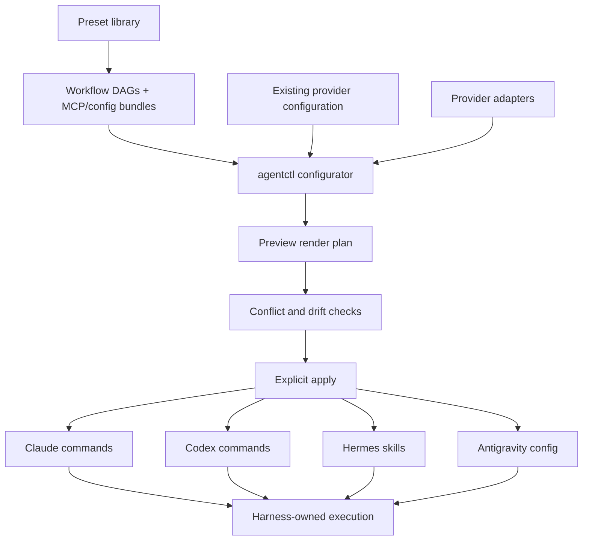

# Agent Workflow Configuration

## Status

This document defines the configuration workflow for `agentctl`. The first
preset-library, scoped render/apply, and guarded-apply TUI slice is implemented;
structured DAG/content editing remains in progress.

`agentctl` is a preset and pipeline configurator for existing command-line agent
harnesses. It defines a reusable library of presets. Each preset can contain
workflow/pipeline DAGs, MCP references, command templates, prompts, skills,
hooks, provider settings, and target mappings. `agentctl` renders those presets
into provider-native files.

Runtime dispatch and live observation are out of scope. Claude Code, Codex CLI,
Hermes, Antigravity, Kaji, and future harnesses own their own execution loops,
sessions, approvals, histories, and runtime state.

## Purpose

`agentctl` should let a user manage many providers and harnesses without having
to remember:

- which reusable presets exist;
- which workflow/pipeline DAGs, phases, MCPs, commands, prompts, skills, hooks, and settings each preset contains;
- which provider mappings are installed, missing, or drifting;
- which Claude, Codex, Hermes, Antigravity, or Kaji configuration already exists outside agentctl;
- which generated files would change before apply;
- which authority boundary a generated command asks the harness to preserve.

The same configuration model should support bugs, features, refactors,
investigations, operational work, existing repositories, and new projects. The
actual work happens after the user invokes the rendered command inside the
chosen harness.

## Product Boundary

### `agentctl` owns

- A local library of reusable presets.
- Provider-neutral workflow/pipeline DAG definitions inside presets.
- Phase prompt/command templates, MCP references, hooks, skills, and settings bundles.
- Provider adapters and capability metadata.
- Provider-native rendering and staging trees.
- Path allowlists, ownership rules, drift detection, conflict detection, and
  backups.
- Explicit preview/apply flows.
- A TUI for designing and reviewing configuration.

### `agentctl` does not own

- Running Claude, Codex, Hermes, Antigravity, Kaji, or other harnesses.
- Watching live agent runs.
- Runtime task queues.
- Runtime phase transitions.
- Agent session history.
- Approval queues.
- Commit, push, PR, deploy, or release actions.

If the TUI observes live work, it becomes a controller. Keep it focused on
configuration authoring, render previews, provider mappings, drift, conflicts,
and explicit apply.

## Design Principles

### Presets Are The Library; Pipelines Are Workflow DAGs

The top-level reusable thing is a preset. A preset is a configuration or
environment bundle the user can create, copy, edit, and preview. A pipeline is
one part of a configuration preset: the workflow DAG or phase graph.
Configuration presets may also include MCP server/tool configuration, command
aliases, prompts, skills, hooks, provider settings, and target mappings.
Environment-only presets reference provider-neutral machine tooling and use the
separate guarded environment installer.

A pipeline in `agentctl` is not a running job. It is a declarative workflow graph
that can be rendered into one or more provider harnesses as part of a preset.

Example shape:

```yaml
preset:
  id: feature-delivery
  description: Feature implementation workflow for CLI agent harnesses
  pipelines:
    default:
      dag:
        scout: [plan]
        plan: [prove]
        prove: [plan-review]
        plan-review: [handoff, plan]
        handoff: [run]
        run: [verify]
        verify: [review, run]
        review: []
  mcps:
    - github
    - filesystem
  commands:
    - /work-scout
    - /work-plan
    - /work-plan-review
    - /work-run
    - /work-verify
    - /work-review
  targets:
    codex:
      render_as: commands
    claude:
      render_as: slash_commands
    hermes:
      render_as: skills
```

### Commands Describe Work, Not Providers

Canonical commands use the `/work-*` namespace:

```text
/work-shape
/work-source
/work-grill
/work-brainstorm
/work-brief
/work-scout
/work-analyze
/work-research
/work-decide
/work-ready
/work-plan
/work-prove
/work-plan-review
/work-handoff
/work-run
/work-verify
/work-review
/work-delegated-review
/work-pr
/work-showcase
/work-cleanup
```

The command identifies the phase. Provider rendering decides how that command is
installed in each harness. The harness decides how to execute it at runtime.

### Provider Aliases Remain First-Class

Provider-prefixed aliases are useful when the user wants an explicit harness:

```text
/codex-shape
/codex-analyze
/codex-plan
/codex-work-loop
/codex-review
/codex-pr-check
```

These aliases preserve canonical phase semantics while rendering provider-aware
instructions for a specific harness. Optional aliases such as `/claude-plan` or
`/antigravity-research` can be added when there is recurring need. The repository
should not generate every possible provider/phase combination by default.

### Rendered Files Are Configuration, Not Runtime State

`agentctl` owns declarative pipeline definitions and rendered provider files it
manages. It should not become the source of truth for live runs, phase progress,
approvals, or agent session history.

Provider runtime directories contain mixed user configuration, caches, sessions,
and generated artifacts. `agentctl` must manage only the files it rendered and
must preserve conflict, drift, backup, path, and symlink protections.

### Authority Never Expands Silently

Generated commands can describe requested authority, but only the external
harness can enforce it at runtime. Changing providers or render targets must not
silently broaden:

- filesystem access;
- network access;
- tool access;
- destructive authority;
- production access;
- permission to commit, push, or open a PR.

## End-to-End Configuration Flow



Plain-text fallback:

```text
preset library + existing provider configuration + provider adapters
  -> preview generated provider files
  -> inspect conflicts and drift
  -> explicit apply
  -> run inside the chosen external harness
```

`agentctl` stops at configuration. The external harness owns running, observing,
pausing, resuming, approving, and recording live work.

## TUI Role

The TUI is a configuration studio. It should help users:

1. browse the preset library;
2. create, copy, edit, rename, or delete presets;
3. edit workflow/pipeline DAGs inside a preset;
4. configure MCP references, commands, prompts, skills, hooks, settings, and provider targets inside a preset;
5. inspect existing Claude, Codex, Hermes, Antigravity, Kaji, and future-harness configuration;
6. compare existing provider files with rendered preset output;
7. preview generated files;
8. inspect drift and conflicts;
9. apply reviewed configuration changes explicitly.

It should not:

- dispatch agents;
- display live runs as active pipelines;
- choose the next runtime phase;
- show approval queues;
- observe or tail harness sessions;
- commit, push, or open PRs.

## Relationship To Kaji

Kaji is an execution harness: it can run multi-agent spec-driven loops. Under the
`agentctl` boundary, Kaji is a possible render target or downstream harness, not
logic to duplicate inside `agentctl`.

Clean split:

```text
agentctl = define, render, validate, install configuration
kaji     = execute multi-agent pipelines when chosen as the harness
```

If Claude Code, Codex CLI, Hermes, or Antigravity can run a pipeline from their
own native configuration, `agentctl` should configure those harnesses directly
instead of introducing a new runner.

## Current Experimental State Commands

The repository currently contains `event`, `task`, `work next`, and
`pipeline start/transition` commands from an earlier state-machine slice. Treat
these as experimental schema fixtures while the configuration model settles.
They should not be presented as the product runtime, and new work should avoid
expanding them into dispatch, observation, approval, or control features.

Future changes should either:

1. narrow those commands to configuration authoring and schema validation; or
2. move runtime execution concerns into a separate harness such as Kaji.

## Implementation Status

Implemented:

1. First-class, versioned preset objects under `config/presets`.
2. Workflow/pipeline DAG data with phases, entry phases, conditions, branches,
   and explicit loops.
3. MCP, command, prompt, skill, hook, settings, and provider-target sections
   whose values reference managed manifest resources.
4. Preset create, copy, metadata edit, delete, list, show, validate, plan,
   render, and apply commands.
5. A Presets TUI backed by the real library and per-preset plans, with guarded
   apply and explicit conflict decisions.

Next:

1. Add structured CLI and TUI editing for preset contents and DAGs.
2. Add provider-configuration inspection views for existing Claude, Codex,
   Hermes, Antigravity, Kaji, and future harnesses.
3. Render broader provider-native commands, prompts, skills, hooks, MCP config, and
   settings from presets.
4. Improve structured settings merge and key ownership.
5. Improve render previews, conflict explanations, and drift explanations.
6. Keep runtime dispatch and live observation out of `agentctl`.
